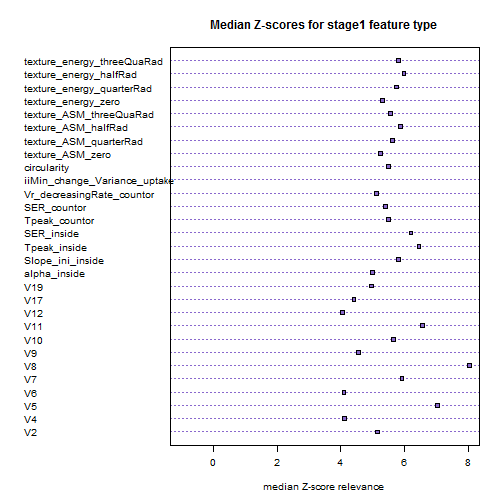

Feature relevance stage 1
====================

```r
setwd("Z:/Cristina/MassNonmass/Section1 - ExperimentsUpToDate/experimentsRadiologypaper-revision/boruta")
read_inputdataStage1 <- function(subdata, ids) {
    library("RSQLite")
    sqlite <- dbDriver("SQLite")
    conn <- dbConnect(sqlite, "stage1localData.db")
    
    # 2) all T1W features
    lesionsQuery <- dbGetQuery(conn, "SELECT *\n           FROM  stage1features\n           INNER JOIN lesion ON (stage1features.lesion_id = lesion.lesion_id)\n           INNER JOIN f_dynamic ON (stage1features.lesion_id = f_dynamic.lesion_id)\n           INNER JOIN f_morphology ON (stage1features.lesion_id = f_morphology.lesion_id)\n           INNER JOIN f_texture ON (stage1features.lesion_id = f_texture.lesion_id)")
    
    # prune entries and extract feature subsets corresponds to 5 entries
    # lesion info, 34 dynamic, 19 morpho, 34 texture fueatures
    lesionfields = names(lesionsQuery)
    lesioninfo = lesionsQuery[c(1, 2, 150, 151)]
    stage1features = lesionsQuery[c(3:103, 124:127)]
    dynfeatures = lesionsQuery[c(154:187)]
    morphofeatures = lesionsQuery[c(190:208)]
    texfeatures = lesionsQuery[c(211:234)]
    
    # combine all features
    allfeatures = cbind(lesioninfo[c(2, 3)], stage1features, dynfeatures, morphofeatures, 
        texfeatures)
    
    if (subdata == "stage2") {
        # organized the data by subdata
        allfeatures = allfeatures[ids, ]
        M <- subset(allfeatures, lesion_label == "massB" | lesion_label == "massM")
        M$lesion_label <- ifelse(M$lesion_label == "massB", "NC", "C")
        N <- subset(allfeatures, lesion_label == "nonmassB" | lesion_label == 
            "nonmassM")
        N$lesion_label <- ifelse(N$lesion_label == "nonmassB", "NC", "C")
        allfeatures = rbind(M, N)
    }
    if (subdata == "stage1") {
        # organized the data by subdata
        allfeatures = allfeatures[ids, ]
        M <- subset(allfeatures, lesion_label == "massB" | lesion_label == "massM")
        M$lesion_label <- ifelse(M$lesion_label == "massB", "mass", "mass")
        N <- subset(allfeatures, lesion_label == "nonmassB" | lesion_label == 
            "nonmassM")
        N$lesion_label <- ifelse(N$lesion_label == "nonmassB", "nonmass", "nonmass")
        allfeatures = data.frame(rbind(M, N))
    }
    if (subdata == "oneshot") {
        # organized the data by subdata
        allfeatures = allfeatures[ids, ]
        M <- subset(allfeatures, lesion_label == "massB" | lesion_label == "massM")
        M$lesion_label <- ifelse(M$lesion_label == "massB", "NC", "C")
        N <- subset(allfeatures, lesion_label == "nonmassB" | lesion_label == 
            "nonmassM")
        N$lesion_label <- ifelse(N$lesion_label == "nonmassB", "NC", "C")
        allfeatures = data.frame(rbind(M, N))
    }
    # procees data
    allfeatures$lesion_label <- as.factor(allfeatures$lesion_label)
    allfeatures$peakCr_inside <- as.factor(allfeatures$peakCr_inside)
    allfeatures$peakVr_inside <- as.factor(allfeatures$peakVr_inside)
    allfeatures$peakCr_countor <- as.factor(allfeatures$peakCr_countor)
    allfeatures$peakVr_countor <- as.factor(allfeatures$peakVr_countor)
    allfeatures$k_Max_Margin_Grad <- as.factor(allfeatures$k_Max_Margin_Grad)
    allfeatures$max_RGH_mean_k <- as.factor(allfeatures$max_RGH_mean_k)
    allfeatures$max_RGH_var_k <- as.factor(allfeatures$max_RGH_var_k)
    
    output <- allfeatures
    return(output)
}
```


You can also embed plots, for example:

```r
stage1dat = read_inputdataStage1("stage1", 1:409)
```

```
## Loading required package: DBI
```

```r

library("Boruta")
```

```
## Loading required package: randomForest
## randomForest 4.6-7
## Type rfNews() to see new features/changes/bug fixes.
```

```r
require(data.table)
```

```
## Loading required package: data.table
```

```r
require(ggplot2)
```

```
## Loading required package: ggplot2
```

```r
set.seed(111)
stage1datnaomit = na.omit(stage1dat)
stage1Boruta <- Boruta(lesion_label ~ ., data = stage1datnaomit[, 2:184], doTrace = 2, 
    ntree = 1000)
```

```
## Initial round 1: ..........
##  82  attributes rejected after this test:  earlySE1 earlySE2 earlySE4 earlySE6 earlySE7 earlySE10 earlySE11 earlySE14 earlySE16 dce2SE0 dce2SE1 dce2SE2 dce2SE3 dce2SE4 dce2SE5 dce2SE7 dce2SE10 dce2SE11 dce2SE12 dce2SE14 dce2SE16 dce2SE19 dce3SE0 dce3SE1 dce3SE3 dce3SE4 dce3SE5 dce3SE10 dce3SE11 dce3SE12 dce3SE14 dce3SE16 dce3SE17 dce3SE19 lateSE0 lateSE1 lateSE2 lateSE3 lateSE4 lateSE5 lateSE6 lateSE7 lateSE15 lateSE17 lateSE18 lateSE19 degreeC closenessC betweennessC no_triangles no_con_comp A_inside maxCr_inside peakCr_inside maxVr_inside Vr_post_1_inside A_countor beta_countor maxCr_countor peakCr_countor washoutRate_countor maxVr_countor peakVr_countor Vr_increasingRate_countor min_F_r_i mean_F_r_i var_F_r_i skew_F_r_i k_Max_Margin_Grad irregularity edge_sharp_mean max_RGH_var max_RGH_var_k texture_contrast_zero texture_contrast_threeQuaRad texture_homogeneity_zero texture_homogeneity_halfRad texture_homogeneity_threeQuaRad texture_dissimilarity_quarterRad texture_dissimilarity_halfRad texture_correlation_halfRad texture_correlation_threeQuaRad 
## 
## Initial round 2: ..........
##  26  attributes rejected after this test:  earlySE5 earlySE8 earlySE17 dce2SE6 dce2SE9 dce2SE13 dce2SE17 dce3SE2 dce3SE6 dce3SE9 dce3SE13 dce3SE15 lateSE10 lateSE12 lateSE16 beta_inside peakVr_inside Vr_increasingRate_inside Vr_decreasingRate_inside Vr_post_1_countor edge_sharp_std max_RGH_mean_k texture_contrast_quarterRad texture_contrast_halfRad texture_dissimilarity_zero texture_correlation_zero 
## 
## Initial round 3: ..........
##  10  attributes rejected after this test:  V15 earlySE9 earlySE12 dce2SE15 dce3SE7 lateSE11 kurt_F_r_i iiiMax_Margin_Gradient ivVariance texture_dissimilarity_threeQuaRad 
## 
## Final round: ..........
##  2  attributes confirmed after this test:  V8 iiMin_change_Variance_uptake 
## 
##  20  attributes rejected after this test:  V13 earlySE3 earlySE13 earlySE15 earlySE19 dce2SE8 dce2SE18 dce3SE18 lateSE8 lateSE9 lateSE13 lateSE14 iAUC1_inside iAUC1_countor Kpeak_countor UptakeRate_countor max_F_r_i max_RGH_mean texture_homogeneity_quarterRad texture_correlation_quarterRad 
## ....
##  4  attributes confirmed after this test:  V5 Slope_ini_inside Tpeak_inside SER_countor 
## 
##  1  attributes rejected after this test:  V18 
## ....
##  8  attributes confirmed after this test:  V7 V19 SER_inside Tpeak_countor texture_ASM_quarterRad texture_ASM_halfRad texture_ASM_threeQuaRad texture_energy_quarterRad 
## 
##  1  attributes rejected after this test:  Slope_ini_countor 
## ...
##  1  attributes rejected after this test:  washoutRate_inside 
## ...
##  3  attributes confirmed after this test:  V11 texture_energy_halfRad texture_energy_threeQuaRad 
## .........
##  3  attributes confirmed after this test:  V2 circularity texture_ASM_zero 
## ..
##  1  attributes confirmed after this test:  V10 
## ...
##  1  attributes confirmed after this test:  texture_energy_zero 
## ...
##  2  attributes confirmed after this test:  alpha_inside Vr_decreasingRate_countor 
## ........
##  1  attributes rejected after this test:  V3 
## ..
##  1  attributes confirmed after this test:  V9 
## .....
##  1  attributes rejected after this test:  earlySE18 
## ...
##  1  attributes confirmed after this test:  V17 
## ..
##  1  attributes confirmed after this test:  V4 
## ..................
##  1  attributes rejected after this test:  dce3SE8 
## ..
##  2  attributes confirmed after this test:  V6 V12 
## ............
##  1  attributes rejected after this test:  UptakeRate_inside 
## .......
```

```r
stage1Boruta
```

```
## Boruta performed 130 randomForest runs in 8.994 mins.
##         29 attributes confirmed important: V2 V4 V5 V6 V7 V8 V9
## V10 V11 V12 V17 V19 alpha_inside Slope_ini_inside Tpeak_inside
## SER_inside Tpeak_countor SER_countor Vr_decreasingRate_countor
## iiMin_change_Variance_uptake circularity texture_ASM_zero
## texture_ASM_quarterRad texture_ASM_halfRad texture_ASM_threeQuaRad
## texture_energy_zero texture_energy_quarterRad
## texture_energy_halfRad texture_energy_threeQuaRad
##         145 attributes confirmed unimportant: V3 V13 V15 V18
## earlySE1 earlySE2 earlySE3 earlySE4 earlySE5 earlySE6 earlySE7
## earlySE8 earlySE9 earlySE10 earlySE11 earlySE12 earlySE13
## earlySE14 earlySE15 earlySE16 earlySE17 earlySE18 earlySE19
## dce2SE0 dce2SE1 dce2SE2 dce2SE3 dce2SE4 dce2SE5 dce2SE6 dce2SE7
## dce2SE8 dce2SE9 dce2SE10 dce2SE11 dce2SE12 dce2SE13 dce2SE14
## dce2SE15 dce2SE16 dce2SE17 dce2SE18 dce2SE19 dce3SE0 dce3SE1
## dce3SE2 dce3SE3 dce3SE4 dce3SE5 dce3SE6 dce3SE7 dce3SE8 dce3SE9
## dce3SE10 dce3SE11 dce3SE12 dce3SE13 dce3SE14 dce3SE15 dce3SE16
## dce3SE17 dce3SE18 dce3SE19 lateSE0 lateSE1 lateSE2 lateSE3 lateSE4
## lateSE5 lateSE6 lateSE7 lateSE8 lateSE9 lateSE10 lateSE11 lateSE12
## lateSE13 lateSE14 lateSE15 lateSE16 lateSE17 lateSE18 lateSE19
## degreeC closenessC betweennessC no_triangles no_con_comp A_inside
## beta_inside iAUC1_inside maxCr_inside peakCr_inside
## UptakeRate_inside washoutRate_inside maxVr_inside peakVr_inside
## Vr_increasingRate_inside Vr_decreasingRate_inside Vr_post_1_inside
## A_countor beta_countor iAUC1_countor Slope_ini_countor
## Kpeak_countor maxCr_countor peakCr_countor UptakeRate_countor
## washoutRate_countor maxVr_countor peakVr_countor
## Vr_increasingRate_countor Vr_post_1_countor min_F_r_i max_F_r_i
## mean_F_r_i var_F_r_i skew_F_r_i kurt_F_r_i iiiMax_Margin_Gradient
## k_Max_Margin_Grad ivVariance irregularity edge_sharp_mean
## edge_sharp_std max_RGH_mean max_RGH_mean_k max_RGH_var
## max_RGH_var_k texture_contrast_zero texture_contrast_quarterRad
## texture_contrast_halfRad texture_contrast_threeQuaRad
## texture_homogeneity_zero texture_homogeneity_quarterRad
## texture_homogeneity_halfRad texture_homogeneity_threeQuaRad
## texture_dissimilarity_zero texture_dissimilarity_quarterRad
## texture_dissimilarity_halfRad texture_dissimilarity_threeQuaRad
## texture_correlation_zero texture_correlation_quarterRad
## texture_correlation_halfRad texture_correlation_threeQuaRad
##         8 tentative attributes left: V0 V1 V14 V16 earlySE0
## Kpeak_inside alpha_countor iMax_Variance_uptake
```

```r
plot(stage1Boruta)
```

 


Now plot Z-scores:
============

```r
#########################################
library("latticeExtra")
```

```
## Loading required package: RColorBrewer
## Loading required package: lattice
## 
## Attaching package: 'latticeExtra'
## 
## The following object(s) are masked from 'package:ggplot2':
## 
##     layer
```

```r
rankingsstage1 <- stage1Boruta$ImpHistory
confirmedstage1_features <- stage1Boruta$finalDecision[stage1Boruta$finalDecision == 
    "Confirmed"]
# Confirmed stage1 features
print(confirmedstage1_features)
```

```
##                           V2                           V4 
##                    Confirmed                    Confirmed 
##                           V5                           V6 
##                    Confirmed                    Confirmed 
##                           V7                           V8 
##                    Confirmed                    Confirmed 
##                           V9                          V10 
##                    Confirmed                    Confirmed 
##                          V11                          V12 
##                    Confirmed                    Confirmed 
##                          V17                          V19 
##                    Confirmed                    Confirmed 
##                 alpha_inside             Slope_ini_inside 
##                    Confirmed                    Confirmed 
##                 Tpeak_inside                   SER_inside 
##                    Confirmed                    Confirmed 
##                Tpeak_countor                  SER_countor 
##                    Confirmed                    Confirmed 
##    Vr_decreasingRate_countor iiMin_change_Variance_uptake 
##                    Confirmed                    Confirmed 
##                  circularity             texture_ASM_zero 
##                    Confirmed                    Confirmed 
##       texture_ASM_quarterRad          texture_ASM_halfRad 
##                    Confirmed                    Confirmed 
##      texture_ASM_threeQuaRad          texture_energy_zero 
##                    Confirmed                    Confirmed 
##    texture_energy_quarterRad       texture_energy_halfRad 
##                    Confirmed                    Confirmed 
##   texture_energy_threeQuaRad 
##                    Confirmed 
## Levels: Tentative Confirmed Rejected
```

```r

####### proces Masses (add fist confirmed feature)
cfeature = as.data.frame(confirmedstage1_features[1])
stage1frame = data.frame(zscores = rankingsstage1[is.finite(rankingsstage1[, 
    rownames(cfeature)]), rownames(cfeature)])
stage1frame$MorN = "stage1"
stage1frame$feature = rownames(cfeature)
stage1zscore_selected <- stage1frame

Medz_scorestage1 = character(length(confirmedstage1_features))
Medz_scorestage1[1] <- median(stage1frame$zscores)
featlabels = character(length(confirmedstage1_features))
featlabels[1] <- rownames(cfeature)

# proces remaining confirmed feature stage1es
for (i in 2:length(confirmedstage1_features)) {
    cfeature = as.data.frame(confirmedstage1_features[i])
    stage1frame = data.frame(zscores = rankingsstage1[, rownames(cfeature)])
    stage1frame$MorN = "stage1"
    stage1frame$feature = rownames(cfeature)
    stage1zscore_selected[nrow(stage1zscore_selected) + 1:nrow(stage1frame), 
        ] <- stage1frame
    
    Medz_scorestage1[i] <- median(stage1frame$zscores)
    featlabels[i] <- rownames(cfeature)
}

# format
featframe = data.frame(feature = featlabels)
featframe$Medz_scorestage1 = Medz_scorestage1
print(featframe)
```

```
##                         feature Medz_scorestage1
## 1                            V2 5.14235443535683
## 2                            V4  4.1095773335244
## 3                            V5 7.02840107906538
## 4                            V6  4.0948839734514
## 5                            V7 5.91577821849148
## 6                            V8 8.03561040027471
## 7                            V9 4.55586241604918
## 8                           V10  5.6385124154202
## 9                           V11 6.55653794943589
## 10                          V12 4.05081042323873
## 11                          V17 4.41108458674876
## 12                          V19 4.95387415616295
## 13                 alpha_inside 4.99404812692431
## 14             Slope_ini_inside 5.80577196928546
## 15                 Tpeak_inside 6.45040337295338
## 16                   SER_inside 6.20205803197663
## 17                Tpeak_countor  5.5021420328039
## 18                  SER_countor 5.40760959481515
## 19    Vr_decreasingRate_countor 5.11901441614614
## 20 iiMin_change_Variance_uptake 8.60342548431513
## 21                  circularity 5.48688872464615
## 22             texture_ASM_zero   5.244728183688
## 23       texture_ASM_quarterRad 5.61955646308552
## 24          texture_ASM_halfRad 5.86851592481896
## 25      texture_ASM_threeQuaRad 5.55107259403085
## 26          texture_energy_zero 5.30303466742662
## 27    texture_energy_quarterRad 5.74426005004974
## 28       texture_energy_halfRad  5.9827908926652
## 29   texture_energy_threeQuaRad  5.8040276447512
```

```r
featframe$color <- "mediumpurple3"

# plot
dotchart(as.numeric(featframe$Medz_scorestage1), labels = featframe$feature, 
    cex = 0.8, pch = 22, lwd = 2, xlim = range(-1, 8), gcolor = "black", lcolor = featframe$color, 
    bg = featframe$color, main = "Median Z-scores for stage1 feature type", 
    xlab = "median Z-score relevance")
```

 
