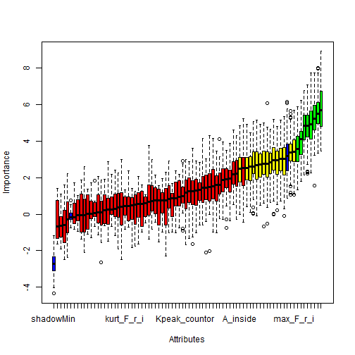
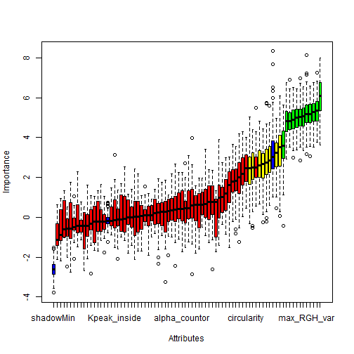
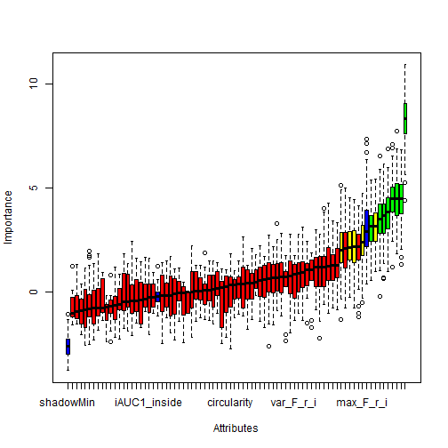
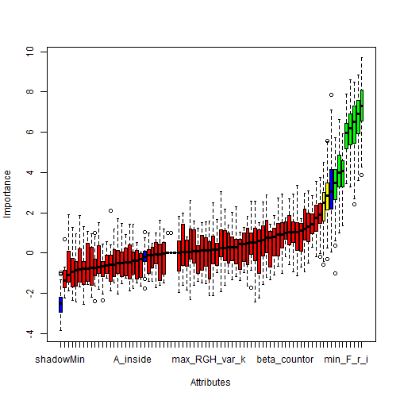
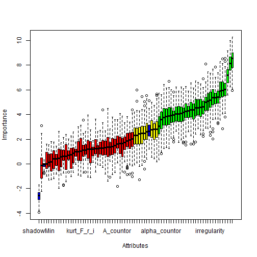
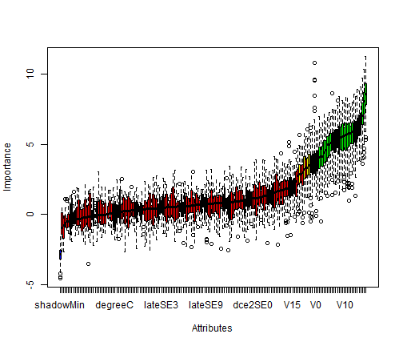
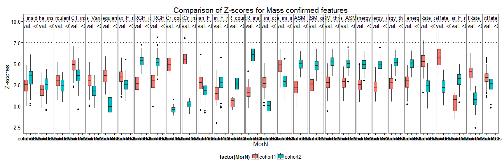
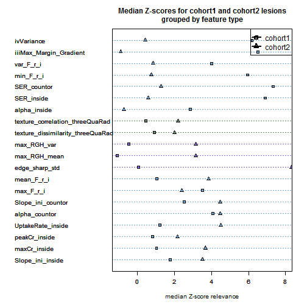
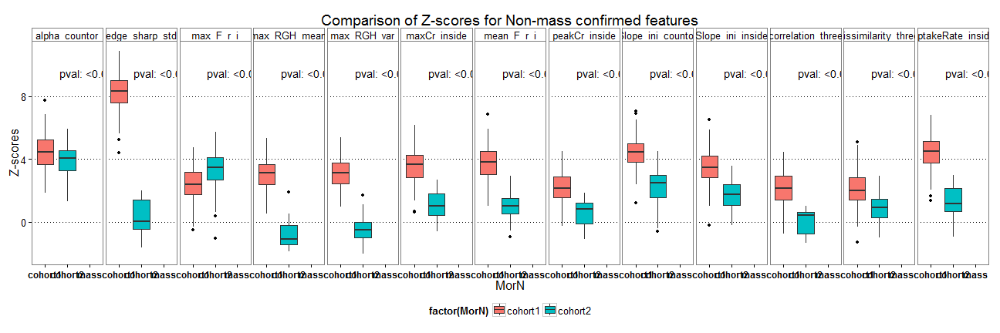

Feature relevance via Z-scores
========================================================


```r
library("Boruta")
```

```
## Loading required package: randomForest
## randomForest 4.6-7
## Type rfNews() to see new features/changes/bug fixes.
```

```r
require(data.table)
```

```
## Loading required package: data.table
```

```r
require(ggplot2)
```

```
## Loading required package: ggplot2
```

```r
library("RSQLite")
```

```
## Loading required package: DBI
```

```r
sqlite <- dbDriver("SQLite")
conn <- dbConnect(sqlite, "localData.db")

# only mass, all T1W features
massQuery <- dbGetQuery(conn, "SELECT *\n                        FROM  mass_lesion\n                        INNER JOIN lesion ON (mass_lesion.lesion_id = lesion.lesion_id)\n                        INNER JOIN f_dynamic ON (lesion.lesion_id = f_dynamic.lesion_id)\n                        INNER JOIN f_morphology ON (lesion.lesion_id = f_morphology.lesion_id)\n                        INNER JOIN f_texture ON (lesion.lesion_id = f_texture.lesion_id)")

# prune entries and extract feature subsets corresponds to 5 entries
# lesion info, 34 dynamic, 19 morpho, 34 texture fueatures
massfields = names(massQuery[c(0:3, 30, 31, 34:67, 70:88, 91:114)])
masslesioninfo = massQuery[c(1:3, 30, 31)]
massfeatures = massQuery[c(1, 3, 34:67, 70:88, 91:114)]
massfeatures$BenignNMaligNAnt <- as.factor(massfeatures$BenignNMaligNAnt)
write.csv(massfeatures, file = "allmassfeatures.csv")

# only Nonmass, all T1W features
nonmassQuery <- dbGetQuery(conn, "SELECT *\n                          FROM  nonmass_lesion\n                          INNER JOIN lesion ON (nonmass_lesion.lesion_id = lesion.lesion_id)\n                          INNER JOIN f_dynamic ON (lesion.lesion_id = f_dynamic.lesion_id)\n                          INNER JOIN f_morphology ON (lesion.lesion_id = f_morphology.lesion_id)\n                          INNER JOIN f_texture ON (lesion.lesion_id = f_texture.lesion_id)")

# prune entries and extract feature subsets corresponds to 5 entries
# lesion info, 34 dynamic, 19 morpho, 34 texture fueatures
nonmassfields = names(nonmassQuery[c(0:3, 30, 31, 34:67, 70:88, 91:114)])
nonmasslesioninfo = nonmassQuery[c(1:3, 30, 31)]
nonmassfeatures = nonmassQuery[c(1, 3, 34:67, 70:88, 91:114)]
nonmassfeatures$BenignNMaligNAnt <- as.factor(nonmassfeatures$BenignNMaligNAnt)
write.csv(nonmassfeatures, file = "nonmassfeatures.csv")


# all T1W features
lesionsQuery <- dbGetQuery(conn, "SELECT *\n                        FROM  lesion\n                        INNER JOIN f_dynamic ON (lesion.lesion_id = f_dynamic.lesion_id)\n                        INNER JOIN f_morphology ON (lesion.lesion_id = f_morphology.lesion_id)\n                        INNER JOIN f_texture ON (lesion.lesion_id = f_texture.lesion_id)")

# prune entries and extract feature subsets corresponds to 5 entries
# lesion info, 34 dynamic, 19 morpho, 34 texture fueatures
lesionsfields = names(lesionsQuery[c(1, 23, 24, 3, 5, 27:60, 63:81, 84:107)])
lesioninfo = lesionsQuery[c(1, 23, 24, 3, 5)]
features = lesionsQuery[c(1, 23, 27:60, 63:81, 84:107)]

M <- subset(features, lesion_label == "massB" | lesion_label == "massM")
M$lesion_label <- ifelse(M$lesion_label == "massB", "mass", "mass")
N <- subset(features, lesion_label == "nonmassB" | lesion_label == "nonmassM")
N$lesion_label <- ifelse(N$lesion_label == "nonmassB", "nonmass", "nonmass")
massnonmassfeatures = data.frame(rbind(M, N))
colnames(massnonmassfeatures)[2] <- "BenignNMaligNAnt"
massnonmassfeatures$BenignNMaligNAnt <- as.factor(massnonmassfeatures$BenignNMaligNAnt)
write.csv(massnonmassfeatures, file = "massnonmassfeatures.csv")

# BenignvsMalignant T1W features
B <- subset(features, lesion_label == "massB" | lesion_label == "nonmassB")
B$lesion_label <- ifelse(B$lesion_label == "massB", "NC", "NC")
M <- subset(features, lesion_label == "massM" | lesion_label == "nonmassM")
M$lesion_label <- ifelse(M$lesion_label == "massM", "C", "C")
BenignvsMalignantfeatures = data.frame(rbind(B, M))
colnames(BenignvsMalignantfeatures)[2] <- "BenignNMaligNAnt"
BenignvsMalignantfeatures$BenignNMaligNAnt <- as.factor(BenignvsMalignantfeatures$BenignNMaligNAnt)
write.csv(BenignvsMalignantfeatures, file = "BenignvsMalignantfeatures.csv")

# multiclass T1W features
multiclassfeatures = features
colnames(multiclassfeatures)[2] <- "BenignNMaligNAnt"
multiclassfeatures$BenignNMaligNAnt <- as.factor(multiclassfeatures$BenignNMaligNAnt)
write.csv(multiclassfeatures, file = "multiclassfeatures.csv")

# Color codes: c('green', 'yellow', 'red', 'blue'), Confirmed, Tentative,
# Rejected and shadow.  Blue boxplots correspond to minimal, average and
# maximum Z score of a shadow attribute. Red

# Boruta mass:
set.seed(111)
massBoruta <- Boruta(BenignNMaligNAnt ~ ., data = massfeatures[, 2:79], doTrace = 2, 
    ntree = 500)
```

```
## Initial round 1: ..........
##  9  attributes rejected after this test:  beta_inside peakVr_inside beta_countor peakVr_countor skew_F_r_i kurt_F_r_i edge_sharp_mean max_RGH_var_k texture_dissimilarity_quarterRad 
## 
## Initial round 2: ..........
##  5  attributes rejected after this test:  Vr_decreasingRate_inside maxVr_countor Vr_decreasingRate_countor iiiMax_Margin_Gradient texture_correlation_quarterRad 
## 
## Initial round 3: ..........
##  7  attributes rejected after this test:  ivVariance max_RGH_mean_k texture_contrast_zero texture_homogeneity_quarterRad texture_dissimilarity_zero texture_correlation_zero texture_correlation_halfRad 
## 
## Final round: ..........
##  8  attributes confirmed after this test:  Slope_ini_inside SER_inside Slope_ini_countor UptakeRate_countor washoutRate_countor max_F_r_i circularity irregularity 
## 
##  9  attributes rejected after this test:  Tpeak_countor Kpeak_countor peakCr_countor k_Max_Margin_Grad edge_sharp_std texture_homogeneity_halfRad texture_homogeneity_threeQuaRad texture_dissimilarity_halfRad texture_correlation_threeQuaRad 
## ....
##  6  attributes confirmed after this test:  iAUC1_inside washoutRate_inside SER_countor maxCr_countor texture_ASM_zero texture_energy_zero 
## 
##  5  attributes rejected after this test:  A_countor iAUC1_countor Vr_post_1_countor texture_contrast_quarterRad texture_dissimilarity_threeQuaRad 
## ....
##  4  attributes confirmed after this test:  UptakeRate_inside iiMin_change_Variance_uptake texture_ASM_threeQuaRad texture_energy_threeQuaRad 
## ...
##  1  attributes confirmed after this test:  texture_energy_quarterRad 
## ...
##  1  attributes confirmed after this test:  mean_F_r_i 
## ...
##  1  attributes confirmed after this test:  texture_ASM_quarterRad 
## ...
##  1  attributes confirmed after this test:  maxCr_inside 
## ...
##  1  attributes confirmed after this test:  texture_energy_halfRad 
## ..
##  2  attributes confirmed after this test:  alpha_inside texture_ASM_halfRad 
## 
##  1  attributes rejected after this test:  alpha_countor 
## ...
##  1  attributes confirmed after this test:  var_F_r_i 
## 
##  1  attributes rejected after this test:  texture_homogeneity_zero 
## ...........
##  1  attributes rejected after this test:  Vr_increasingRate_countor 
## ......................
##  1  attributes rejected after this test:  maxVr_inside 
## ......................
##  1  attributes confirmed after this test:  Tpeak_inside 
## .....
##  1  attributes rejected after this test:  max_RGH_mean 
## ..
```

```r
massBoruta
```

```
## Boruta performed 130 randomForest runs in 2.29 mins.
##         27 attributes confirmed important: alpha_inside
## iAUC1_inside Slope_ini_inside Tpeak_inside SER_inside maxCr_inside
## UptakeRate_inside washoutRate_inside Slope_ini_countor SER_countor
## maxCr_countor UptakeRate_countor washoutRate_countor max_F_r_i
## mean_F_r_i var_F_r_i iiMin_change_Variance_uptake circularity
## irregularity texture_ASM_zero texture_ASM_quarterRad
## texture_ASM_halfRad texture_ASM_threeQuaRad texture_energy_zero
## texture_energy_quarterRad texture_energy_halfRad
## texture_energy_threeQuaRad
##         40 attributes confirmed unimportant: beta_inside
## maxVr_inside peakVr_inside Vr_decreasingRate_inside A_countor
## alpha_countor beta_countor iAUC1_countor Tpeak_countor
## Kpeak_countor peakCr_countor maxVr_countor peakVr_countor
## Vr_increasingRate_countor Vr_decreasingRate_countor
## Vr_post_1_countor skew_F_r_i kurt_F_r_i iiiMax_Margin_Gradient
## k_Max_Margin_Grad ivVariance edge_sharp_mean edge_sharp_std
## max_RGH_mean max_RGH_mean_k max_RGH_var_k texture_contrast_zero
## texture_contrast_quarterRad texture_homogeneity_zero
## texture_homogeneity_quarterRad texture_homogeneity_halfRad
## texture_homogeneity_threeQuaRad texture_dissimilarity_zero
## texture_dissimilarity_quarterRad texture_dissimilarity_halfRad
## texture_dissimilarity_threeQuaRad texture_correlation_zero
## texture_correlation_quarterRad texture_correlation_halfRad
## texture_correlation_threeQuaRad
##         10 tentative attributes left: A_inside Kpeak_inside
## peakCr_inside Vr_increasingRate_inside Vr_post_1_inside min_F_r_i
## iMax_Variance_uptake max_RGH_var texture_contrast_halfRad
## texture_contrast_threeQuaRad
```

```r

plot(massBoruta)
```

 

```r

# Boruta non-mass:
set.seed(111)
nonmassBoruta <- Boruta(BenignNMaligNAnt ~ ., data = nonmassfeatures[, 2:79], 
    doTrace = 2, ntree = 500)
```

```
## Initial round 1: ..........
##  30  attributes rejected after this test:  A_inside beta_inside maxVr_inside peakVr_inside Vr_increasingRate_inside Vr_post_1_inside maxVr_countor peakVr_countor Vr_increasingRate_countor Vr_decreasingRate_countor Vr_post_1_countor min_F_r_i kurt_F_r_i k_Max_Margin_Grad circularity irregularity edge_sharp_mean max_RGH_mean_k max_RGH_var_k texture_homogeneity_zero texture_homogeneity_quarterRad texture_correlation_zero texture_correlation_halfRad texture_ASM_zero texture_ASM_quarterRad texture_ASM_threeQuaRad texture_energy_zero texture_energy_quarterRad texture_energy_halfRad texture_energy_threeQuaRad 
## 
## Initial round 2: ..........
##  10  attributes rejected after this test:  iAUC1_inside Vr_decreasingRate_inside A_countor iAUC1_countor skew_F_r_i texture_contrast_zero texture_homogeneity_halfRad texture_homogeneity_threeQuaRad texture_correlation_quarterRad texture_ASM_halfRad 
## 
## Initial round 3: ..........
##  2  attributes rejected after this test:  texture_contrast_quarterRad texture_dissimilarity_zero 
## 
## Final round: ..........
##  5  attributes confirmed after this test:  Slope_ini_inside alpha_countor Slope_ini_countor SER_countor max_F_r_i 
## 
##  6  attributes rejected after this test:  Kpeak_countor maxCr_countor peakCr_countor washoutRate_countor texture_dissimilarity_quarterRad texture_dissimilarity_halfRad 
## ....
##  2  attributes rejected after this test:  Tpeak_inside UptakeRate_countor 
## ....
##  2  attributes confirmed after this test:  SER_inside iiiMax_Margin_Gradient 
## 
##  2  attributes rejected after this test:  Kpeak_inside maxCr_inside 
## ......
##  2  attributes confirmed after this test:  mean_F_r_i ivVariance 
## ...
##  2  attributes confirmed after this test:  var_F_r_i edge_sharp_std 
## ..............
##  2  attributes confirmed after this test:  peakCr_inside UptakeRate_inside 
## ..
##  1  attributes confirmed after this test:  texture_contrast_halfRad 
## .............
##  1  attributes confirmed after this test:  texture_contrast_threeQuaRad 
## 
##  1  attributes rejected after this test:  beta_countor 
## .....
##  1  attributes rejected after this test:  texture_correlation_threeQuaRad 
## ........
##  1  attributes rejected after this test:  Tpeak_countor 
## .......
##  1  attributes confirmed after this test:  texture_dissimilarity_threeQuaRad 
## ............
##  1  attributes confirmed after this test:  washoutRate_inside 
## ...
##  1  attributes rejected after this test:  alpha_inside 
## .........
```

```r
nonmassBoruta
```

```
## Boruta performed 130 randomForest runs in 33.57 secs.
##         17 attributes confirmed important: Slope_ini_inside
## SER_inside peakCr_inside UptakeRate_inside washoutRate_inside
## alpha_countor Slope_ini_countor SER_countor max_F_r_i mean_F_r_i
## var_F_r_i iiiMax_Margin_Gradient ivVariance edge_sharp_std
## texture_contrast_halfRad texture_contrast_threeQuaRad
## texture_dissimilarity_threeQuaRad
##         56 attributes confirmed unimportant: A_inside alpha_inside
## beta_inside iAUC1_inside Tpeak_inside Kpeak_inside maxCr_inside
## maxVr_inside peakVr_inside Vr_increasingRate_inside
## Vr_decreasingRate_inside Vr_post_1_inside A_countor beta_countor
## iAUC1_countor Tpeak_countor Kpeak_countor maxCr_countor
## peakCr_countor UptakeRate_countor washoutRate_countor
## maxVr_countor peakVr_countor Vr_increasingRate_countor
## Vr_decreasingRate_countor Vr_post_1_countor min_F_r_i skew_F_r_i
## kurt_F_r_i k_Max_Margin_Grad circularity irregularity
## edge_sharp_mean max_RGH_mean_k max_RGH_var_k texture_contrast_zero
## texture_contrast_quarterRad texture_homogeneity_zero
## texture_homogeneity_quarterRad texture_homogeneity_halfRad
## texture_homogeneity_threeQuaRad texture_dissimilarity_zero
## texture_dissimilarity_quarterRad texture_dissimilarity_halfRad
## texture_correlation_zero texture_correlation_quarterRad
## texture_correlation_halfRad texture_correlation_threeQuaRad
## texture_ASM_zero texture_ASM_quarterRad texture_ASM_halfRad
## texture_ASM_threeQuaRad texture_energy_zero
## texture_energy_quarterRad texture_energy_halfRad
## texture_energy_threeQuaRad
##         4 tentative attributes left: iMax_Variance_uptake
## iiMin_change_Variance_uptake max_RGH_mean max_RGH_var
```

```r

plot(nonmassBoruta)
```

 

```r

# Boruta for mass vs nonmass
set.seed(111)
massnonmassBoruta <- Boruta(BenignNMaligNAnt ~ ., data = massnonmassfeatures[, 
    2:79], doTrace = 2, ntree = 500)
```

```
## Initial round 1: ..........
##  11  attributes rejected after this test:  beta_inside Vr_post_1_inside maxVr_countor peakVr_countor min_F_r_i max_F_r_i var_F_r_i k_Max_Margin_Grad edge_sharp_mean max_RGH_var max_RGH_var_k 
## 
## Initial round 2: ..........
##  17  attributes rejected after this test:  A_inside maxCr_inside maxVr_inside A_countor iAUC1_countor Slope_ini_countor maxCr_countor washoutRate_countor Vr_post_1_countor mean_F_r_i max_RGH_mean_k texture_contrast_quarterRad texture_contrast_threeQuaRad texture_homogeneity_quarterRad texture_dissimilarity_halfRad texture_correlation_zero texture_correlation_threeQuaRad 
## 
## Initial round 3: ..........
##  7  attributes rejected after this test:  peakVr_inside beta_countor peakCr_countor irregularity edge_sharp_std texture_contrast_halfRad texture_dissimilarity_quarterRad 
## 
## Final round: ..........
##  5  attributes rejected after this test:  Vr_increasingRate_inside Kpeak_countor skew_F_r_i max_RGH_mean texture_homogeneity_halfRad 
## ....
##  8  attributes rejected after this test:  iAUC1_inside Vr_decreasingRate_inside UptakeRate_countor ivVariance texture_contrast_zero texture_dissimilarity_zero texture_correlation_quarterRad texture_energy_zero 
## ....
##  1  attributes confirmed after this test:  iiMin_change_Variance_uptake 
## 
##  1  attributes rejected after this test:  iiiMax_Margin_Gradient 
## ...
##  1  attributes confirmed after this test:  Vr_decreasingRate_countor 
## 
##  5  attributes rejected after this test:  washoutRate_inside Vr_increasingRate_countor texture_homogeneity_zero texture_dissimilarity_threeQuaRad texture_ASM_halfRad 
## ...
##  1  attributes rejected after this test:  peakCr_inside 
## ...
##  1  attributes confirmed after this test:  Tpeak_inside 
## ...
##  1  attributes rejected after this test:  texture_homogeneity_threeQuaRad 
## .....
##  2  attributes confirmed after this test:  Slope_ini_inside SER_inside 
## ......
##  1  attributes confirmed after this test:  alpha_inside 
## .....
##  1  attributes rejected after this test:  kurt_F_r_i 
## ...
##  1  attributes confirmed after this test:  Tpeak_countor 
## .....
##  1  attributes rejected after this test:  UptakeRate_inside 
## .................
##  2  attributes confirmed after this test:  SER_countor texture_energy_halfRad 
## .............................
```

```r
massnonmassBoruta
```

```
## Boruta performed 130 randomForest runs in 3.108 mins.
##         9 attributes confirmed important: alpha_inside
## Slope_ini_inside Tpeak_inside SER_inside Tpeak_countor SER_countor
## Vr_decreasingRate_countor iiMin_change_Variance_uptake
## texture_energy_halfRad
##         58 attributes confirmed unimportant: A_inside beta_inside
## iAUC1_inside maxCr_inside peakCr_inside UptakeRate_inside
## washoutRate_inside maxVr_inside peakVr_inside
## Vr_increasingRate_inside Vr_decreasingRate_inside Vr_post_1_inside
## A_countor beta_countor iAUC1_countor Slope_ini_countor
## Kpeak_countor maxCr_countor peakCr_countor UptakeRate_countor
## washoutRate_countor maxVr_countor peakVr_countor
## Vr_increasingRate_countor Vr_post_1_countor min_F_r_i max_F_r_i
## mean_F_r_i var_F_r_i skew_F_r_i kurt_F_r_i iiiMax_Margin_Gradient
## k_Max_Margin_Grad ivVariance irregularity edge_sharp_mean
## edge_sharp_std max_RGH_mean max_RGH_mean_k max_RGH_var
## max_RGH_var_k texture_contrast_zero texture_contrast_quarterRad
## texture_contrast_halfRad texture_contrast_threeQuaRad
## texture_homogeneity_zero texture_homogeneity_quarterRad
## texture_homogeneity_halfRad texture_homogeneity_threeQuaRad
## texture_dissimilarity_zero texture_dissimilarity_quarterRad
## texture_dissimilarity_halfRad texture_dissimilarity_threeQuaRad
## texture_correlation_zero texture_correlation_quarterRad
## texture_correlation_threeQuaRad texture_ASM_halfRad
## texture_energy_zero
##         10 tentative attributes left: Kpeak_inside alpha_countor
## iMax_Variance_uptake circularity texture_correlation_halfRad
## texture_ASM_zero texture_ASM_quarterRad texture_ASM_threeQuaRad
## texture_energy_quarterRad texture_energy_threeQuaRad
```

```r

plot(massnonmassBoruta)
```

 

```r

# Boruta for benign vs malignant
set.seed(111)
BenignvsMalignantBoruta <- Boruta(BenignNMaligNAnt ~ ., data = BenignvsMalignantfeatures[, 
    2:79], doTrace = 2, ntree = 500)
```

```
## Initial round 1: ..........
##  4  attributes rejected after this test:  peakVr_countor skew_F_r_i kurt_F_r_i max_RGH_var_k 
## 
## Initial round 2: ..........
##  4  attributes rejected after this test:  peakVr_inside beta_countor edge_sharp_mean max_RGH_mean_k 
## 
## Initial round 3: ..........
##  4  attributes rejected after this test:  maxVr_countor Vr_post_1_countor k_Max_Margin_Grad texture_correlation_zero 
## 
## Final round: ..........
##  22  attributes confirmed after this test:  iAUC1_inside Slope_ini_inside SER_inside maxCr_inside peakCr_inside UptakeRate_inside washoutRate_inside alpha_countor Slope_ini_countor SER_countor maxCr_countor UptakeRate_countor washoutRate_countor max_F_r_i mean_F_r_i var_F_r_i iMax_Variance_uptake iiMin_change_Variance_uptake circularity irregularity texture_contrast_halfRad texture_contrast_threeQuaRad 
## 
##  5  attributes rejected after this test:  Vr_decreasingRate_inside Vr_decreasingRate_countor texture_homogeneity_quarterRad texture_dissimilarity_zero texture_correlation_halfRad 
## ....
##  2  attributes confirmed after this test:  alpha_inside Tpeak_inside 
## 
##  1  attributes rejected after this test:  beta_inside 
## ....
##  1  attributes rejected after this test:  maxVr_inside 
## ...
##  1  attributes rejected after this test:  texture_dissimilarity_quarterRad 
## ...
##  1  attributes confirmed after this test:  texture_dissimilarity_threeQuaRad 
## 
##  4  attributes rejected after this test:  Vr_post_1_inside Vr_increasingRate_countor texture_homogeneity_zero texture_correlation_quarterRad 
## ...
##  1  attributes confirmed after this test:  min_F_r_i 
## 
##  1  attributes rejected after this test:  Vr_increasingRate_inside 
## ......
##  1  attributes rejected after this test:  A_countor 
## ..
##  1  attributes rejected after this test:  texture_homogeneity_halfRad 
## ...
##  1  attributes rejected after this test:  edge_sharp_std 
## ...
##  1  attributes confirmed after this test:  Kpeak_inside 
## .........................
##  1  attributes rejected after this test:  ivVariance 
## ...
##  1  attributes rejected after this test:  texture_correlation_threeQuaRad 
## .......
##  1  attributes confirmed after this test:  texture_ASM_threeQuaRad 
## ...................
##  1  attributes rejected after this test:  texture_contrast_quarterRad 
## .....
```

```r
BenignvsMalignantBoruta
```

```
## Boruta performed 130 randomForest runs in 4.341 mins.
##         28 attributes confirmed important: alpha_inside
## iAUC1_inside Slope_ini_inside Tpeak_inside Kpeak_inside SER_inside
## maxCr_inside peakCr_inside UptakeRate_inside washoutRate_inside
## alpha_countor Slope_ini_countor SER_countor maxCr_countor
## UptakeRate_countor washoutRate_countor min_F_r_i max_F_r_i
## mean_F_r_i var_F_r_i iMax_Variance_uptake
## iiMin_change_Variance_uptake circularity irregularity
## texture_contrast_halfRad texture_contrast_threeQuaRad
## texture_dissimilarity_threeQuaRad texture_ASM_threeQuaRad
##         31 attributes confirmed unimportant: beta_inside
## maxVr_inside peakVr_inside Vr_increasingRate_inside
## Vr_decreasingRate_inside Vr_post_1_inside A_countor beta_countor
## maxVr_countor peakVr_countor Vr_increasingRate_countor
## Vr_decreasingRate_countor Vr_post_1_countor skew_F_r_i kurt_F_r_i
## k_Max_Margin_Grad ivVariance edge_sharp_mean edge_sharp_std
## max_RGH_mean_k max_RGH_var_k texture_contrast_quarterRad
## texture_homogeneity_zero texture_homogeneity_quarterRad
## texture_homogeneity_halfRad texture_dissimilarity_zero
## texture_dissimilarity_quarterRad texture_correlation_zero
## texture_correlation_quarterRad texture_correlation_halfRad
## texture_correlation_threeQuaRad
##         18 tentative attributes left: A_inside iAUC1_countor
## Tpeak_countor Kpeak_countor peakCr_countor iiiMax_Margin_Gradient
## max_RGH_mean max_RGH_var texture_contrast_zero
## texture_homogeneity_threeQuaRad texture_dissimilarity_halfRad
## texture_ASM_zero texture_ASM_quarterRad texture_ASM_halfRad
## texture_energy_zero texture_energy_quarterRad
## texture_energy_halfRad texture_energy_threeQuaRad
```

```r

plot(BenignvsMalignantBoruta)
```

 

```r

# Boruta for multiclass
set.seed(111)
multiclassBoruta <- Boruta(BenignNMaligNAnt ~ ., data = multiclassfeatures[, 
    2:79], doTrace = 2, ntree = 500)
```

```
## Initial round 1: ..........
##  8  attributes rejected after this test:  peakVr_inside peakVr_countor k_Max_Margin_Grad edge_sharp_mean max_RGH_mean_k texture_contrast_quarterRad texture_dissimilarity_zero texture_dissimilarity_halfRad 
## 
## Initial round 2: ..........
##  10  attributes rejected after this test:  maxVr_inside beta_countor skew_F_r_i texture_contrast_zero texture_homogeneity_quarterRad texture_homogeneity_threeQuaRad texture_dissimilarity_quarterRad texture_correlation_zero texture_correlation_quarterRad texture_correlation_halfRad 
## 
## Initial round 3: ..........
##  1  attributes rejected after this test:  Vr_post_1_countor 
## 
## Final round: ..........
##  14  attributes confirmed after this test:  alpha_inside Slope_ini_inside Tpeak_inside SER_inside UptakeRate_inside washoutRate_inside Slope_ini_countor SER_countor UptakeRate_countor max_F_r_i iMax_Variance_uptake iiMin_change_Variance_uptake circularity irregularity 
## 
##  3  attributes rejected after this test:  Vr_decreasingRate_inside maxVr_countor texture_correlation_threeQuaRad 
## ....
##  9  attributes confirmed after this test:  peakCr_inside washoutRate_countor mean_F_r_i texture_ASM_zero texture_ASM_quarterRad texture_ASM_halfRad texture_ASM_threeQuaRad texture_energy_quarterRad texture_energy_threeQuaRad 
## 
##  3  attributes rejected after this test:  A_countor Kpeak_countor max_RGH_var_k 
## ....
##  2  attributes confirmed after this test:  iAUC1_inside maxCr_countor 
## 
##  7  attributes rejected after this test:  peakCr_countor Vr_increasingRate_countor Vr_decreasingRate_countor min_F_r_i kurt_F_r_i iiiMax_Margin_Gradient texture_homogeneity_halfRad 
## ...
##  2  attributes confirmed after this test:  alpha_countor texture_energy_halfRad 
## 
##  1  attributes rejected after this test:  iAUC1_countor 
## ...
##  2  attributes confirmed after this test:  var_F_r_i texture_energy_zero 
## ......
##  1  attributes confirmed after this test:  maxCr_inside 
## 
##  1  attributes rejected after this test:  Vr_post_1_inside 
## .....
##  1  attributes rejected after this test:  ivVariance 
## ....................................
##  1  attributes rejected after this test:  Vr_increasingRate_inside 
## ...
##  1  attributes confirmed after this test:  max_RGH_mean 
## ............
##  1  attributes rejected after this test:  beta_inside 
## ..............
```

```r
multiclassBoruta
```

```
## Boruta performed 130 randomForest runs in 5.346 mins.
##         31 attributes confirmed important: alpha_inside
## iAUC1_inside Slope_ini_inside Tpeak_inside SER_inside maxCr_inside
## peakCr_inside UptakeRate_inside washoutRate_inside alpha_countor
## Slope_ini_countor SER_countor maxCr_countor UptakeRate_countor
## washoutRate_countor max_F_r_i mean_F_r_i var_F_r_i
## iMax_Variance_uptake iiMin_change_Variance_uptake circularity
## irregularity max_RGH_mean texture_ASM_zero texture_ASM_quarterRad
## texture_ASM_halfRad texture_ASM_threeQuaRad texture_energy_zero
## texture_energy_quarterRad texture_energy_halfRad
## texture_energy_threeQuaRad
##         37 attributes confirmed unimportant: beta_inside
## maxVr_inside peakVr_inside Vr_increasingRate_inside
## Vr_decreasingRate_inside Vr_post_1_inside A_countor beta_countor
## iAUC1_countor Kpeak_countor peakCr_countor maxVr_countor
## peakVr_countor Vr_increasingRate_countor Vr_decreasingRate_countor
## Vr_post_1_countor min_F_r_i skew_F_r_i kurt_F_r_i
## iiiMax_Margin_Gradient k_Max_Margin_Grad ivVariance
## edge_sharp_mean max_RGH_mean_k max_RGH_var_k texture_contrast_zero
## texture_contrast_quarterRad texture_homogeneity_quarterRad
## texture_homogeneity_halfRad texture_homogeneity_threeQuaRad
## texture_dissimilarity_zero texture_dissimilarity_quarterRad
## texture_dissimilarity_halfRad texture_correlation_zero
## texture_correlation_quarterRad texture_correlation_halfRad
## texture_correlation_threeQuaRad
##         9 tentative attributes left: A_inside Kpeak_inside
## Tpeak_countor edge_sharp_std max_RGH_var texture_contrast_halfRad
## texture_contrast_threeQuaRad texture_homogeneity_zero
## texture_dissimilarity_threeQuaRad
```

```r

plot(multiclassBoruta)
```

 


Now plot Z-scores:
=======================

```r
#########################################
library("latticeExtra")
```

```
## Loading required package: RColorBrewer
## Loading required package: lattice
## 
## Attaching package: 'latticeExtra'
## 
## The following object(s) are masked from 'package:ggplot2':
## 
##     layer
```

```r
rankingsmass <- massBoruta$ImpHistory
rankingsnonmass <- nonmassBoruta$ImpHistory

confirmedmass_features <- massBoruta$finalDecision[massBoruta$finalDecision == 
    "Confirmed"]
# Confirmed mass features
print(confirmedmass_features)
```

```
##                 alpha_inside                 iAUC1_inside 
##                    Confirmed                    Confirmed 
##             Slope_ini_inside                 Tpeak_inside 
##                    Confirmed                    Confirmed 
##                   SER_inside                 maxCr_inside 
##                    Confirmed                    Confirmed 
##            UptakeRate_inside           washoutRate_inside 
##                    Confirmed                    Confirmed 
##            Slope_ini_countor                  SER_countor 
##                    Confirmed                    Confirmed 
##                maxCr_countor           UptakeRate_countor 
##                    Confirmed                    Confirmed 
##          washoutRate_countor                    max_F_r_i 
##                    Confirmed                    Confirmed 
##                   mean_F_r_i                    var_F_r_i 
##                    Confirmed                    Confirmed 
## iiMin_change_Variance_uptake                  circularity 
##                    Confirmed                    Confirmed 
##                 irregularity             texture_ASM_zero 
##                    Confirmed                    Confirmed 
##       texture_ASM_quarterRad          texture_ASM_halfRad 
##                    Confirmed                    Confirmed 
##      texture_ASM_threeQuaRad          texture_energy_zero 
##                    Confirmed                    Confirmed 
##    texture_energy_quarterRad       texture_energy_halfRad 
##                    Confirmed                    Confirmed 
##   texture_energy_threeQuaRad 
##                    Confirmed 
## Levels: Tentative Confirmed Rejected
```

```r

confirmednonmass_features <- nonmassBoruta$finalDecision[nonmassBoruta$finalDecision == 
    "Confirmed"]
# Confirmed nonmass features
print(confirmednonmass_features)
```

```
##                  Slope_ini_inside                        SER_inside 
##                         Confirmed                         Confirmed 
##                     peakCr_inside                 UptakeRate_inside 
##                         Confirmed                         Confirmed 
##                washoutRate_inside                     alpha_countor 
##                         Confirmed                         Confirmed 
##                 Slope_ini_countor                       SER_countor 
##                         Confirmed                         Confirmed 
##                         max_F_r_i                        mean_F_r_i 
##                         Confirmed                         Confirmed 
##                         var_F_r_i            iiiMax_Margin_Gradient 
##                         Confirmed                         Confirmed 
##                        ivVariance                    edge_sharp_std 
##                         Confirmed                         Confirmed 
##          texture_contrast_halfRad      texture_contrast_threeQuaRad 
##                         Confirmed                         Confirmed 
## texture_dissimilarity_threeQuaRad 
##                         Confirmed 
## Levels: Tentative Confirmed Rejected
```

```r


####### proces Masses (add fist confirmed feature)
cfeature = as.data.frame(confirmedmass_features[1])
massframe = data.frame(zscores = rankingsmass[is.finite(rankingsmass[, rownames(cfeature)]), 
    rownames(cfeature)])
massframe$MorN = "mass"
massframe$feature = rownames(cfeature)
masszscore_selected <- massframe

nonmassframe = data.frame(zscores = rankingsnonmass[is.finite(rankingsnonmass[, 
    rownames(cfeature)]), rownames(cfeature)])
nonmassframe$MorN = "nonmass"
nonmassframe$feature = rownames(cfeature)
masszscore_selected[nrow(masszscore_selected) + 1:nrow(nonmassframe), ] <- nonmassframe

masszscore_ttest = numeric(length(confirmedmass_features))
masszscore_ttest[1] = t.test(as.data.frame(massframe)$zscores, as.data.frame(nonmassframe)$zscores, 
    alternative = "two.sided", paired = FALSE, var.equal = FALSE)$p.value

pvallabels = character(length(confirmedmass_features))
pvallabels[1] <- rownames(cfeature)

Medz_scoreMass = character(length(confirmedmass_features))
Medz_scoreMass[1] <- median(massframe$zscores)
Medz_scoreNonmass = character(length(confirmedmass_features))
Medz_scoreNonmass[1] <- median(nonmassframe$zscores)

# proces remaining confirmed feature Masses
for (i in 2:length(confirmedmass_features)) {
    cfeature = as.data.frame(confirmedmass_features[i])
    massframe = data.frame(zscores = rankingsmass[, rownames(cfeature)])
    massframe$MorN = "mass"
    massframe$feature = rownames(cfeature)
    masszscore_selected[nrow(masszscore_selected) + 1:nrow(massframe), ] <- massframe
    
    nonmassframe = data.frame(zscores = rankingsnonmass[, rownames(cfeature)])
    nonmassframe$MorN = "nonmass"
    nonmassframe$feature = rownames(cfeature)
    masszscore_selected[nrow(masszscore_selected) + 1:nrow(nonmassframe), ] <- nonmassframe
    
    # p-values test
    masszscore_ttest[i] = t.test(massframe$zscores[is.finite(massframe$zscores)], 
        nonmassframe$zscores[is.finite(nonmassframe$zscores)], alternative = "two.sided", 
        paired = FALSE, var.equal = FALSE)$p.value
    pvallabels[i] <- rownames(cfeature)
    
    Medz_scoreMass[i] <- median(massframe$zscores)
    Medz_scoreNonmass[i] <- median(nonmassframe$zscores)
}

# format p values and order in dataframe
dt <- data.table(masszscore_ttest)
pval <- dt[, list(pvalue = paste0("pval: ", format.pval(masszscore_ttest, eps = 0.001)))]

pvalframe = data.frame(pvalue = pval)
pvalframe$feature = pvallabels
pvalframe$Medz_scoreMass = Medz_scoreMass
pvalframe$Medz_scoreNonmass = Medz_scoreNonmass
print(pvalframe)
```

```
##          pvalue                      feature   Medz_scoreMass
## 1  pval: <0.001                 alpha_inside 3.72643460791657
## 2  pval: <0.001                 iAUC1_inside 5.49653202325443
## 3  pval: <0.001             Slope_ini_inside 7.41995952907895
## 4  pval: <0.001                 Tpeak_inside 3.25426170908672
## 5  pval: 0.0019                   SER_inside 5.85918236859728
## 6  pval: <0.001                 maxCr_inside 4.12899158899416
## 7  pval: <0.001            UptakeRate_inside 5.16074657051028
## 8  pval: <0.001           washoutRate_inside 4.82343974491284
## 9  pval: <0.001            Slope_ini_countor 5.29688867741446
## 10 pval: <0.001                  SER_countor 4.23199187072562
## 11 pval: <0.001                maxCr_countor  4.0054234587162
## 12 pval: <0.001           UptakeRate_countor 5.42436538699713
## 13 pval: <0.001          washoutRate_countor 5.25431465503698
## 14 pval: <0.001                    max_F_r_i 5.41738092319141
## 15 pval: <0.001                   mean_F_r_i 3.72763216686067
## 16 pval: 0.0015                    var_F_r_i 3.84296983952241
## 17 pval: <0.001 iiMin_change_Variance_uptake 5.00746706662652
## 18 pval: <0.001                  circularity 5.44714550785231
## 19 pval: <0.001                 irregularity 6.62392457188307
## 20 pval: <0.001             texture_ASM_zero 4.42023074979814
## 21 pval: <0.001       texture_ASM_quarterRad 4.34625980964635
## 22 pval: <0.001          texture_ASM_halfRad 4.18560791748292
## 23 pval: <0.001      texture_ASM_threeQuaRad 4.38968595751726
## 24 pval: <0.001          texture_energy_zero 4.49929827917123
## 25 pval: <0.001    texture_energy_quarterRad 4.27763740596377
## 26 pval: <0.001       texture_energy_halfRad 4.19645399080177
## 27 pval: <0.001   texture_energy_threeQuaRad 4.30967681885716
##    Medz_scoreNonmass
## 1   2.29647635327051
## 2               -Inf
## 3   5.39338750016501
## 4               -Inf
## 5   5.62377402227592
## 6               -Inf
## 7    4.0837633182279
## 8   3.40697029254541
## 9   6.28165293861431
## 10  6.50576239656254
## 11              -Inf
## 12              -Inf
## 13              -Inf
## 14  4.68435757977446
## 15  4.46051599608606
## 16   4.2485697296019
## 17   2.8749205935935
## 18              -Inf
## 19              -Inf
## 20              -Inf
## 21              -Inf
## 22              -Inf
## 23              -Inf
## 24              -Inf
## 25              -Inf
## 26              -Inf
## 27              -Inf
```

Create steam plot with MedZ-scores mass vs. non-mass


```r

pvalframe$Medz_scoreMass <- as.numeric(pvalframe$Medz_scoreMass)
pvalframe$Medz_scoreNonmass <- as.numeric(pvalframe$Medz_scoreNonmass)
# pvalframe <- pvalframe[order(pvalframe$Medz_scoreMass, decreasing =
# TRUE),] # sort decre by Medz_scoreMass
pvalframe$feature <- factor(pvalframe$feature)  # it must be a factor
pvalframe$Medz_scoreNonmass[pvalframe$Medz_scoreNonmass == -Inf] = 0

pvalframe$color <- "skyblue3"
pvalframe$color[18:19] <- "mediumpurple3"
pvalframe$color[20:27] <- "darkseagreen4"

dotchart(pvalframe$Medz_scoreMass, labels = pvalframe$feature, cex = 0.8, pch = 22, 
    lwd = 2, xlim = range(-1, 8), gcolor = "black", lcolor = pvalframe$color, 
    bg = pvalframe$color, main = "Median Z-scores for mass and non-mass lesions\ngrouped feature type", 
    xlab = "median Z-score relevance")
par(new = TRUE)
dotchart(pvalframe$Medz_scoreNonmass, labels = pvalframe$feature, cex = 0.8, 
    pch = 24, lwd = 2, xlim = range(-1, 8), gcolor = "black", lcolor = pvalframe$color, 
    bg = pvalframe$color)
legend("topright", legend = c("mass", "nonmass"), pch = c(22, 24), lwd = 2, 
    col = c("black", "black"))
```

 


# generate boxplot comparison of relevant mass features vs. the same non-mass feature


```
## Warning: Removed 120 rows containing non-finite values (stat_boxplot).
## Warning: Removed 110 rows containing non-finite values (stat_boxplot).
## Warning: Removed 120 rows containing non-finite values (stat_boxplot).
## Warning: Removed 90 rows containing non-finite values (stat_boxplot).
## Warning: Removed 82 rows containing non-finite values (stat_boxplot).
## Warning: Removed 110 rows containing non-finite values (stat_boxplot).
## Warning: Removed 120 rows containing non-finite values (stat_boxplot).
## Warning: Removed 120 rows containing non-finite values (stat_boxplot).
## Warning: Removed 120 rows containing non-finite values (stat_boxplot).
## Warning: Removed 120 rows containing non-finite values (stat_boxplot).
## Warning: Removed 120 rows containing non-finite values (stat_boxplot).
## Warning: Removed 120 rows containing non-finite values (stat_boxplot).
## Warning: Removed 120 rows containing non-finite values (stat_boxplot).
## Warning: Removed 86 rows containing non-finite values (stat_boxplot).
## Warning: Removed 86 rows containing non-finite values (stat_boxplot).
## Warning: Removed 90 rows containing non-finite values (stat_boxplot).
```

```
## ymax not defined: adjusting position using y instead
## ymax not defined: adjusting position using y instead
## ymax not defined: adjusting position using y instead
## ymax not defined: adjusting position using y instead
## ymax not defined: adjusting position using y instead
## ymax not defined: adjusting position using y instead
## ymax not defined: adjusting position using y instead
## ymax not defined: adjusting position using y instead
## ymax not defined: adjusting position using y instead
## ymax not defined: adjusting position using y instead
## ymax not defined: adjusting position using y instead
## ymax not defined: adjusting position using y instead
## ymax not defined: adjusting position using y instead
## ymax not defined: adjusting position using y instead
## ymax not defined: adjusting position using y instead
## ymax not defined: adjusting position using y instead
## ymax not defined: adjusting position using y instead
## ymax not defined: adjusting position using y instead
## ymax not defined: adjusting position using y instead
## ymax not defined: adjusting position using y instead
## ymax not defined: adjusting position using y instead
## ymax not defined: adjusting position using y instead
## ymax not defined: adjusting position using y instead
## ymax not defined: adjusting position using y instead
## ymax not defined: adjusting position using y instead
## ymax not defined: adjusting position using y instead
## ymax not defined: adjusting position using y instead
```

 


```r
####### proces Non-Masses
bfeature = as.data.frame(confirmednonmass_features[1])
nonmassframe = data.frame(zscores = rankingsnonmass[is.finite(rankingsnonmass[, 
    rownames(bfeature)]), rownames(bfeature)])
nonmassframe$MorN = "nonmass"
nonmassframe$feature = rownames(bfeature)
nonmasszscore_selected <- nonmassframe

massframe = data.frame(zscores = rankingsmass[is.finite(rankingsmass[, rownames(bfeature)]), 
    rownames(bfeature)])
massframe$MorN = "mass"
massframe$feature = rownames(bfeature)
nonmasszscore_selected[nrow(nonmasszscore_selected) + 1:nrow(massframe), ] <- massframe

nonmasszscore_ttest = numeric(length(confirmednonmass_features))
nonmasszscore_ttest[1] = t.test(as.data.frame(nonmassframe)$zscores, as.data.frame(massframe)$zscores, 
    alternative = "two.sided", paired = FALSE, var.equal = FALSE)$p.value

Medz_scoreNonmass = character(length(confirmednonmass_features))
Medz_scoreNonmass[1] <- median(nonmassframe$zscores)
Medz_scoreMass = character(length(confirmednonmass_features))
Medz_scoreMass[1] <- median(massframe$zscores)

pvallabels = character(length(confirmednonmass_features))
pvallabels[1] <- rownames(bfeature)

for (i in 2:length(confirmednonmass_features)) {
    bfeature = as.data.frame(confirmednonmass_features[i])
    nonmassframe = data.frame(zscores = rankingsnonmass[is.finite(rankingsnonmass[, 
        rownames(bfeature)]), rownames(bfeature)])
    nonmassframe$MorN = "nonmass"
    nonmassframe$feature = rownames(bfeature)
    nonmasszscore_selected[nrow(nonmasszscore_selected) + 1:nrow(nonmassframe), 
        ] <- nonmassframe
    
    massframe = data.frame(zscores = rankingsmass[is.finite(rankingsmass[, rownames(bfeature)]), 
        rownames(bfeature)])
    massframe$MorN = "mass"
    massframe$feature = rownames(bfeature)
    nonmasszscore_selected[nrow(nonmasszscore_selected) + 1:nrow(massframe), 
        ] <- massframe
    
    # p-values test
    nonmasszscore_ttest[i] = t.test(as.data.frame(nonmassframe)$zscores, as.data.frame(massframe)$zscores, 
        alternative = "two.sided", paired = FALSE, var.equal = FALSE)$p.value
    
    pvallabels[i] <- rownames(bfeature)
    Medz_scoreMass[i] <- median(massframe$zscores)
    Medz_scoreNonmass[i] <- median(nonmassframe$zscores)
}

# format p values and order in dataframe
dt <- data.table(nonmasszscore_ttest)
pval <- dt[, list(pvalue = paste0("pval: ", format.pval(nonmasszscore_ttest, 
    eps = 0.001)))]

pvalframe = data.frame(pvalue = pval)
pvalframe$feature = pvallabels
pvalframe$Medz_scoreNonmass = Medz_scoreNonmass
pvalframe$Medz_scoreMass = Medz_scoreMass
print(pvalframe)
```

```
##          pvalue                           feature Medz_scoreNonmass
## 1  pval: <0.001                  Slope_ini_inside  5.39338750016501
## 2  pval: 0.0019                        SER_inside  5.62377402227592
## 3  pval: <0.001                     peakCr_inside   3.4969086461104
## 4  pval: <0.001                 UptakeRate_inside   4.0837633182279
## 5  pval: <0.001                washoutRate_inside  3.40697029254541
## 6  pval: <0.001                     alpha_countor  5.80303637208856
## 7  pval: <0.001                 Slope_ini_countor  6.28165293861431
## 8  pval: <0.001                       SER_countor  6.50576239656254
## 9  pval: <0.001                         max_F_r_i  4.68435757977446
## 10 pval: <0.001                        mean_F_r_i  4.46051599608606
## 11 pval: 0.0015                         var_F_r_i   4.2485697296019
## 12 pval: <0.001            iiiMax_Margin_Gradient  6.08490013970087
## 13 pval: <0.001                        ivVariance  4.28443583006683
## 14 pval: <0.001                    edge_sharp_std  4.16420379668512
## 15 pval: <0.001          texture_contrast_halfRad  3.82786421912304
## 16 pval: <0.001      texture_contrast_threeQuaRad  3.78731132298919
## 17 pval: <0.001 texture_dissimilarity_threeQuaRad  3.72648168226528
##       Medz_scoreMass
## 1   7.41995952907895
## 2   5.85918236859728
## 3   3.03978972098254
## 4   5.16074657051028
## 5   4.82343974491284
## 6    2.3506401440379
## 7   5.29688867741446
## 8   4.23199187072562
## 9   5.41738092319141
## 10  3.72763216686067
## 11  3.84296983952241
## 12 0.677118409466961
## 13  1.03050119388507
## 14  1.90386975007468
## 15  2.67525813492422
## 16   2.7261893707716
## 17  1.26186964660343
```

Create steam plot with MedZ-scores mass vs. non-mass


```r

pvalframe$Medz_scoreNonmass <- as.numeric(pvalframe$Medz_scoreNonmass)
pvalframe$Medz_scoreMass <- as.numeric(pvalframe$Medz_scoreMass)
# pvalframe <- pvalframe[order(pvalframe$Medz_scoreMass, decreasing =
# TRUE),] # sort decre by Medz_scoreMass
pvalframe$feature <- factor(pvalframe$feature)  # it must be a factor
pvalframe$Medz_scoreNonmass[pvalframe$Medz_scoreNonmass == -Inf] = 0

pvalframe$color <- "skyblue3"
pvalframe$color[14] <- "mediumpurple3"
pvalframe$color[15:17] <- "darkseagreen4"

dotchart(pvalframe$Medz_scoreNonmass, labels = pvalframe$feature, cex = 0.8, 
    pch = 24, lwd = 2, xlim = range(-1, 8), gcolor = "black", lcolor = pvalframe$color, 
    bg = pvalframe$color)
par(new = TRUE)
dotchart(pvalframe$Medz_scoreMass, labels = pvalframe$feature, cex = 0.8, pch = 22, 
    lwd = 2, xlim = range(-1, 8), gcolor = "black", lcolor = pvalframe$color, 
    bg = pvalframe$color, main = "Median Z-scores for mass and non-mass lesions\ngrouped by feature type", 
    xlab = "median Z-score relevance")
legend("topright", legend = c("mass", "nonmass"), pch = c(22, 24), lwd = 2, 
    col = c("black", "black"))
```

 

```r

```

Create a stem plot of only common relevant features

```r

## subset pvalframe for only comonly relevant
commonrelev = pvalframe[1:2, ]
commonrelev = rbind(commonrelev, pvalframe[4:5, ])
commonrelev = rbind(commonrelev, pvalframe[7:11, ])
print(commonrelev)
```

```
##          pvalue            feature Medz_scoreNonmass Medz_scoreMass
## 1  pval: <0.001   Slope_ini_inside             5.393          7.420
## 2  pval: 0.0019         SER_inside             5.624          5.859
## 4  pval: <0.001  UptakeRate_inside             4.084          5.161
## 5  pval: <0.001 washoutRate_inside             3.407          4.823
## 7  pval: <0.001  Slope_ini_countor             6.282          5.297
## 8  pval: <0.001        SER_countor             6.506          4.232
## 9  pval: <0.001          max_F_r_i             4.684          5.417
## 10 pval: <0.001         mean_F_r_i             4.461          3.728
## 11 pval: 0.0015          var_F_r_i             4.249          3.843
##       color
## 1  skyblue3
## 2  skyblue3
## 4  skyblue3
## 5  skyblue3
## 7  skyblue3
## 8  skyblue3
## 9  skyblue3
## 10 skyblue3
## 11 skyblue3
```

```r

dotchart(commonrelev$Medz_scoreNonmass, labels = commonrelev$feature, cex = 0.8, 
    pch = 24, lwd = 2, xlim = range(-1, 8), gcolor = "black", lcolor = commonrelev$color, 
    bg = commonrelev$color)
par(new = TRUE)
dotchart(commonrelev$Medz_scoreMass, labels = commonrelev$feature, cex = 0.8, 
    pch = 22, lwd = 2, xlim = range(-1, 8), gcolor = "black", lcolor = commonrelev$color, 
    bg = commonrelev$color, main = "Median Z-scores for mass and non-mass lesions\ngrouped by feature type", 
    xlab = "median Z-score relevance")
legend("topright", legend = c("mass", "nonmass"), pch = c(22, 24), lwd = 2, 
    col = c("black", "black"))
```

 

```r

```


 


