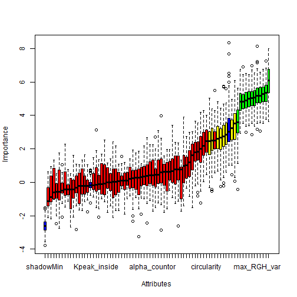
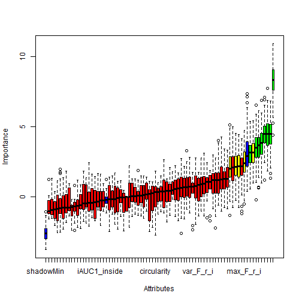
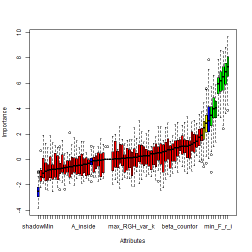
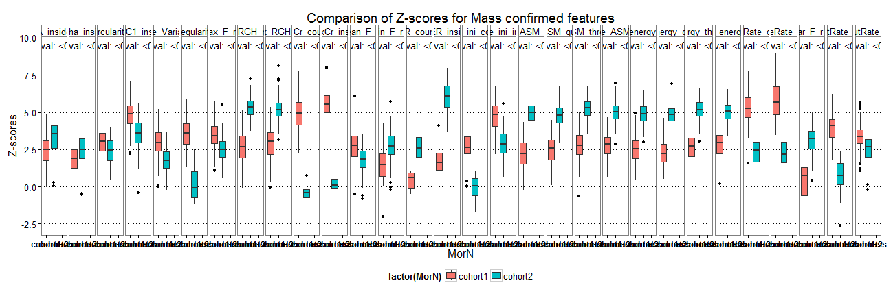

Feature relevance via Z-scores
========================================================


```r
library("Boruta")
```

```
## Loading required package: randomForest
## randomForest 4.6-7
## Type rfNews() to see new features/changes/bug fixes.
```

```r
require(data.table)
```

```
## Loading required package: data.table
```

```r
require(ggplot2)
```

```
## Loading required package: ggplot2
```

```r
library("RSQLite")
```

```
## Loading required package: DBI
```

```r
sqlite <- dbDriver("SQLite")
conn <- dbConnect(sqlite, "localData.db")

# all T1W features
lesionsQuery <- dbGetQuery(conn, "SELECT *\n                        FROM  lesion\n                        INNER JOIN f_dynamic ON (lesion.lesion_id = f_dynamic.lesion_id)\n                        INNER JOIN f_morphology ON (lesion.lesion_id = f_morphology.lesion_id)\n                        INNER JOIN f_texture ON (lesion.lesion_id = f_texture.lesion_id)")

# prune entries and extract feature subsets corresponds to 5 entries
# lesion info, 34 dynamic, 19 morpho, 34 texture fueatures
lesionsfields = names(lesionsQuery[c(1, 23, 24, 3, 5, 27:60, 63:81, 84:107)])
lesioninfo = lesionsQuery[c(1, 23, 24, 3, 5)]
features = lesionsQuery[c(1, 23, 27:60, 63:81, 84:107)]

# split lesions into 2 cohorts
cohort1_features = features[c(1:272), ]
cohort2_features = features[c(273:410), ]

M <- subset(cohort1_features, lesion_label == "massB" | lesion_label == "massM")
M$lesion_label <- ifelse(M$lesion_label == "massB", "NC", "C")
M$lesion_label <- as.factor(M$lesion_label)
mass_cohort1_features = M

M <- subset(cohort2_features, lesion_label == "massB" | lesion_label == "massM")
M$lesion_label <- ifelse(M$lesion_label == "massB", "NC", "C")
M$lesion_label <- as.factor(M$lesion_label)
mass_cohort2_features = M

N <- subset(cohort1_features, lesion_label == "nonmassB" | lesion_label == "nonmassM")
N$lesion_label <- ifelse(N$lesion_label == "nonmassB", "NC", "C")
N$lesion_label <- as.factor(N$lesion_label)
nonmass_cohort1_features = N

N <- subset(cohort2_features, lesion_label == "nonmassB" | lesion_label == "nonmassM")
N$lesion_label <- ifelse(N$lesion_label == "nonmassB", "NC", "C")
N$lesion_label <- as.factor(N$lesion_label)
nonmass_cohort2_features = N

# Color codes: c('green', 'yellow', 'red', 'blue'), Confirmed, Tentative,
# Rejected and shadow.  Blue boxplots correspond to minimal, average and
# maximum Z score of a shadow attribute. Red


# Boruta mass:
set.seed(111)
massBoruta_cohort1 <- Boruta(lesion_label ~ ., data = mass_cohort1_features[, 
    2:79], doTrace = 2, ntree = 500)
```

```
## Initial round 1: ..........
##  19  attributes rejected after this test:  beta_inside peakVr_inside beta_countor SER_countor peakCr_countor Vr_decreasingRate_countor var_F_r_i skew_F_r_i kurt_F_r_i iMax_Variance_uptake iiiMax_Margin_Gradient k_Max_Margin_Grad ivVariance edge_sharp_mean texture_homogeneity_halfRad texture_dissimilarity_halfRad texture_dissimilarity_threeQuaRad texture_correlation_halfRad texture_correlation_threeQuaRad 
## 
## Initial round 2: ..........
##  12  attributes rejected after this test:  maxVr_inside Vr_decreasingRate_inside Vr_post_1_inside Tpeak_countor maxVr_countor peakVr_countor max_RGH_mean_k max_RGH_var_k texture_contrast_quarterRad texture_homogeneity_zero texture_dissimilarity_quarterRad texture_correlation_quarterRad 
## 
## Initial round 3: ..........
##  2  attributes rejected after this test:  texture_homogeneity_quarterRad texture_correlation_zero 
## 
## Final round: ..........
##  10  attributes rejected after this test:  SER_inside Vr_increasingRate_inside iAUC1_countor Kpeak_countor Vr_post_1_countor texture_contrast_zero texture_contrast_halfRad texture_contrast_threeQuaRad texture_homogeneity_threeQuaRad texture_dissimilarity_zero 
## ....
##  2  attributes confirmed after this test:  maxCr_inside UptakeRate_inside 
## 
##  4  attributes rejected after this test:  Tpeak_inside Kpeak_inside A_countor alpha_countor 
## ....
##  4  attributes confirmed after this test:  iAUC1_inside Slope_ini_inside maxCr_countor UptakeRate_countor 
## 
##  3  attributes rejected after this test:  alpha_inside Vr_increasingRate_countor texture_energy_quarterRad 
## ...
##  1  attributes rejected after this test:  edge_sharp_std 
## ............
##  1  attributes rejected after this test:  min_F_r_i 
## ........
##  1  attributes confirmed after this test:  washoutRate_countor 
## .............
##  1  attributes rejected after this test:  texture_ASM_halfRad 
## .......
##  1  attributes confirmed after this test:  irregularity 
## ..................................
##  1  attributes rejected after this test:  peakCr_inside 
## .....
```

```r
massBoruta_cohort1
```

```
## Boruta performed 130 randomForest runs in 59.73 secs.
##         8 attributes confirmed important: iAUC1_inside
## Slope_ini_inside maxCr_inside UptakeRate_inside maxCr_countor
## UptakeRate_countor washoutRate_countor irregularity
##         54 attributes confirmed unimportant: alpha_inside
## beta_inside Tpeak_inside Kpeak_inside SER_inside peakCr_inside
## maxVr_inside peakVr_inside Vr_increasingRate_inside
## Vr_decreasingRate_inside Vr_post_1_inside A_countor alpha_countor
## beta_countor iAUC1_countor Tpeak_countor Kpeak_countor SER_countor
## peakCr_countor maxVr_countor peakVr_countor
## Vr_increasingRate_countor Vr_decreasingRate_countor
## Vr_post_1_countor min_F_r_i var_F_r_i skew_F_r_i kurt_F_r_i
## iMax_Variance_uptake iiiMax_Margin_Gradient k_Max_Margin_Grad
## ivVariance edge_sharp_mean edge_sharp_std max_RGH_mean_k
## max_RGH_var_k texture_contrast_zero texture_contrast_quarterRad
## texture_contrast_halfRad texture_contrast_threeQuaRad
## texture_homogeneity_zero texture_homogeneity_quarterRad
## texture_homogeneity_halfRad texture_homogeneity_threeQuaRad
## texture_dissimilarity_zero texture_dissimilarity_quarterRad
## texture_dissimilarity_halfRad texture_dissimilarity_threeQuaRad
## texture_correlation_zero texture_correlation_quarterRad
## texture_correlation_halfRad texture_correlation_threeQuaRad
## texture_ASM_halfRad texture_energy_quarterRad
##         15 tentative attributes left: A_inside washoutRate_inside
## Slope_ini_countor max_F_r_i mean_F_r_i
## iiMin_change_Variance_uptake circularity max_RGH_mean max_RGH_var
## texture_ASM_zero texture_ASM_quarterRad texture_ASM_threeQuaRad
## texture_energy_zero texture_energy_halfRad
## texture_energy_threeQuaRad
```

```r

plot(massBoruta_cohort1)
```

 

```r

set.seed(111)
massBoruta_cohort2 <- Boruta(lesion_label ~ ., data = mass_cohort2_features[, 
    2:79], doTrace = 2, ntree = 500)
```

```
## Initial round 1: ..........
##  22  attributes rejected after this test:  maxCr_inside peakCr_inside maxVr_inside peakVr_inside Vr_increasingRate_inside beta_countor Slope_ini_countor Tpeak_countor Kpeak_countor maxCr_countor peakCr_countor peakVr_countor Vr_decreasingRate_countor Vr_post_1_countor skew_F_r_i edge_sharp_mean max_RGH_mean_k max_RGH_var_k texture_contrast_halfRad texture_homogeneity_threeQuaRad texture_dissimilarity_quarterRad texture_dissimilarity_halfRad 
## 
## Initial round 2: ..........
##  14  attributes rejected after this test:  Vr_decreasingRate_inside Vr_post_1_inside iAUC1_countor maxVr_countor Vr_increasingRate_countor iMax_Variance_uptake k_Max_Margin_Grad irregularity texture_contrast_quarterRad texture_homogeneity_quarterRad texture_homogeneity_halfRad texture_dissimilarity_threeQuaRad texture_correlation_zero texture_correlation_quarterRad 
## 
## Initial round 3: ..........
##  9  attributes rejected after this test:  Kpeak_inside A_countor kurt_F_r_i iiiMax_Margin_Gradient edge_sharp_std texture_contrast_zero texture_contrast_threeQuaRad texture_homogeneity_zero texture_correlation_halfRad 
## 
## Final round: ..........
##  7  attributes confirmed after this test:  SER_inside max_RGH_mean max_RGH_var texture_ASM_halfRad texture_ASM_threeQuaRad texture_energy_zero texture_energy_quarterRad 
## 
##  6  attributes rejected after this test:  Tpeak_inside alpha_countor washoutRate_countor ivVariance texture_dissimilarity_zero texture_correlation_threeQuaRad 
## ....
##  4  attributes confirmed after this test:  texture_ASM_zero texture_ASM_quarterRad texture_energy_halfRad texture_energy_threeQuaRad 
## ..........
##  1  attributes rejected after this test:  iiMin_change_Variance_uptake 
## ...........................
##  1  attributes rejected after this test:  mean_F_r_i 
## ..........
##  1  attributes rejected after this test:  beta_inside 
## .............
##  1  attributes rejected after this test:  circularity 
## .......
##  2  attributes rejected after this test:  UptakeRate_inside max_F_r_i 
## ............
##  1  attributes confirmed after this test:  iAUC1_inside 
## .......
```

```r
massBoruta_cohort2
```

```
## Boruta performed 130 randomForest runs in 17.16 secs.
##         12 attributes confirmed important: iAUC1_inside SER_inside
## max_RGH_mean max_RGH_var texture_ASM_zero texture_ASM_quarterRad
## texture_ASM_halfRad texture_ASM_threeQuaRad texture_energy_zero
## texture_energy_quarterRad texture_energy_halfRad
## texture_energy_threeQuaRad
##         57 attributes confirmed unimportant: beta_inside
## Tpeak_inside Kpeak_inside maxCr_inside peakCr_inside
## UptakeRate_inside maxVr_inside peakVr_inside
## Vr_increasingRate_inside Vr_decreasingRate_inside Vr_post_1_inside
## A_countor alpha_countor beta_countor iAUC1_countor
## Slope_ini_countor Tpeak_countor Kpeak_countor maxCr_countor
## peakCr_countor washoutRate_countor maxVr_countor peakVr_countor
## Vr_increasingRate_countor Vr_decreasingRate_countor
## Vr_post_1_countor max_F_r_i mean_F_r_i skew_F_r_i kurt_F_r_i
## iMax_Variance_uptake iiMin_change_Variance_uptake
## iiiMax_Margin_Gradient k_Max_Margin_Grad ivVariance circularity
## irregularity edge_sharp_mean edge_sharp_std max_RGH_mean_k
## max_RGH_var_k texture_contrast_zero texture_contrast_quarterRad
## texture_contrast_halfRad texture_contrast_threeQuaRad
## texture_homogeneity_zero texture_homogeneity_quarterRad
## texture_homogeneity_halfRad texture_homogeneity_threeQuaRad
## texture_dissimilarity_zero texture_dissimilarity_quarterRad
## texture_dissimilarity_halfRad texture_dissimilarity_threeQuaRad
## texture_correlation_zero texture_correlation_quarterRad
## texture_correlation_halfRad texture_correlation_threeQuaRad
##         8 tentative attributes left: A_inside alpha_inside
## Slope_ini_inside washoutRate_inside SER_countor UptakeRate_countor
## min_F_r_i var_F_r_i
```

```r

plot(massBoruta_cohort2)
```

 

```r

# Boruta non-mass:
set.seed(111)
nonmassBoruta_cohort1 <- Boruta(lesion_label ~ ., data = nonmass_cohort1_features[, 
    2:79], doTrace = 2, ntree = 500)
```

```
## Initial round 1: ..........
##  40  attributes rejected after this test:  A_inside alpha_inside iAUC1_inside Tpeak_inside Kpeak_inside peakVr_inside Vr_increasingRate_inside Vr_decreasingRate_inside Vr_post_1_inside iAUC1_countor Tpeak_countor peakCr_countor maxVr_countor Vr_decreasingRate_countor Vr_post_1_countor min_F_r_i var_F_r_i kurt_F_r_i iiMin_change_Variance_uptake iiiMax_Margin_Gradient k_Max_Margin_Grad irregularity edge_sharp_mean max_RGH_var_k texture_contrast_zero texture_contrast_quarterRad texture_homogeneity_zero texture_homogeneity_quarterRad texture_homogeneity_halfRad texture_homogeneity_threeQuaRad texture_correlation_zero texture_correlation_halfRad texture_ASM_zero texture_ASM_quarterRad texture_ASM_halfRad texture_ASM_threeQuaRad texture_energy_zero texture_energy_quarterRad texture_energy_halfRad texture_energy_threeQuaRad 
## 
## Initial round 2: ..........
##  5  attributes rejected after this test:  beta_inside maxVr_inside ivVariance circularity texture_dissimilarity_zero 
## 
## Initial round 3: ..........
##  5  attributes rejected after this test:  SER_inside Kpeak_countor peakVr_countor iMax_Variance_uptake max_RGH_mean_k 
## 
## Final round: ..........
##  1  attributes confirmed after this test:  edge_sharp_std 
## 
##  6  attributes rejected after this test:  A_countor washoutRate_countor Vr_increasingRate_countor skew_F_r_i texture_contrast_halfRad texture_dissimilarity_halfRad 
## ....
##  2  attributes rejected after this test:  beta_countor UptakeRate_countor 
## ....
##  1  attributes confirmed after this test:  UptakeRate_inside 
## 
##  1  attributes rejected after this test:  texture_correlation_quarterRad 
## ...
##  2  attributes rejected after this test:  maxCr_countor texture_contrast_threeQuaRad 
## ...
##  1  attributes confirmed after this test:  Slope_ini_countor 
## .........
##  1  attributes confirmed after this test:  alpha_countor 
## ..
##  1  attributes rejected after this test:  SER_countor 
## ......
##  1  attributes confirmed after this test:  mean_F_r_i 
## ..
##  1  attributes confirmed after this test:  max_RGH_mean 
## ......
##  1  attributes confirmed after this test:  Slope_ini_inside 
## ..........
##  1  attributes confirmed after this test:  maxCr_inside 
## ....................................
##  1  attributes rejected after this test:  washoutRate_inside 
## ...
##  1  attributes rejected after this test:  texture_dissimilarity_quarterRad 
## ..
```

```r
nonmassBoruta_cohort1
```

```
## Boruta performed 130 randomForest runs in 14.29 secs.
##         8 attributes confirmed important: Slope_ini_inside
## maxCr_inside UptakeRate_inside alpha_countor Slope_ini_countor
## mean_F_r_i edge_sharp_std max_RGH_mean
##         64 attributes confirmed unimportant: A_inside alpha_inside
## beta_inside iAUC1_inside Tpeak_inside Kpeak_inside SER_inside
## washoutRate_inside maxVr_inside peakVr_inside
## Vr_increasingRate_inside Vr_decreasingRate_inside Vr_post_1_inside
## A_countor beta_countor iAUC1_countor Tpeak_countor Kpeak_countor
## SER_countor maxCr_countor peakCr_countor UptakeRate_countor
## washoutRate_countor maxVr_countor peakVr_countor
## Vr_increasingRate_countor Vr_decreasingRate_countor
## Vr_post_1_countor min_F_r_i var_F_r_i skew_F_r_i kurt_F_r_i
## iMax_Variance_uptake iiMin_change_Variance_uptake
## iiiMax_Margin_Gradient k_Max_Margin_Grad ivVariance circularity
## irregularity edge_sharp_mean max_RGH_mean_k max_RGH_var_k
## texture_contrast_zero texture_contrast_quarterRad
## texture_contrast_halfRad texture_contrast_threeQuaRad
## texture_homogeneity_zero texture_homogeneity_quarterRad
## texture_homogeneity_halfRad texture_homogeneity_threeQuaRad
## texture_dissimilarity_zero texture_dissimilarity_quarterRad
## texture_dissimilarity_halfRad texture_correlation_zero
## texture_correlation_quarterRad texture_correlation_halfRad
## texture_ASM_zero texture_ASM_quarterRad texture_ASM_halfRad
## texture_ASM_threeQuaRad texture_energy_zero
## texture_energy_quarterRad texture_energy_halfRad
## texture_energy_threeQuaRad
##         5 tentative attributes left: peakCr_inside max_F_r_i
## max_RGH_var texture_dissimilarity_threeQuaRad
## texture_correlation_threeQuaRad
```

```r

plot(nonmassBoruta_cohort1)
```

 

```r

set.seed(111)
nonmassBoruta_cohort2 <- Boruta(lesion_label ~ ., data = nonmass_cohort2_features[, 
    2:79], doTrace = 2, ntree = 500)
```

```
## Initial round 1: ..........
##  39  attributes rejected after this test:  A_inside iAUC1_inside Tpeak_inside Kpeak_inside washoutRate_inside maxVr_inside peakVr_inside Vr_increasingRate_inside Vr_decreasingRate_inside Vr_post_1_inside A_countor beta_countor iAUC1_countor Kpeak_countor maxCr_countor peakCr_countor UptakeRate_countor washoutRate_countor peakVr_countor kurt_F_r_i k_Max_Margin_Grad max_RGH_mean max_RGH_mean_k max_RGH_var_k texture_contrast_quarterRad texture_contrast_halfRad texture_contrast_threeQuaRad texture_homogeneity_zero texture_homogeneity_quarterRad texture_homogeneity_halfRad texture_dissimilarity_zero texture_dissimilarity_quarterRad texture_correlation_zero texture_correlation_halfRad texture_correlation_threeQuaRad texture_ASM_quarterRad texture_ASM_threeQuaRad texture_energy_zero texture_energy_halfRad 
## 
## Initial round 2: ..........
##  11  attributes rejected after this test:  beta_inside Tpeak_countor circularity edge_sharp_std max_RGH_var texture_contrast_zero texture_homogeneity_threeQuaRad texture_dissimilarity_halfRad texture_ASM_zero texture_ASM_halfRad texture_energy_quarterRad 
## 
## Initial round 3: ..........
##  5  attributes rejected after this test:  maxCr_inside peakCr_inside Vr_increasingRate_countor iiMin_change_Variance_uptake texture_energy_threeQuaRad 
## 
## Final round: ..........
##  4  attributes confirmed after this test:  SER_inside SER_countor min_F_r_i iiiMax_Margin_Gradient 
## 
##  5  attributes rejected after this test:  Vr_decreasingRate_countor Vr_post_1_countor mean_F_r_i iMax_Variance_uptake edge_sharp_mean 
## ....
##  1  attributes confirmed after this test:  ivVariance 
## 
##  3  attributes rejected after this test:  UptakeRate_inside maxVr_countor texture_dissimilarity_threeQuaRad 
## ....
##  3  attributes rejected after this test:  Slope_ini_inside skew_F_r_i irregularity 
## ....................
##  1  attributes confirmed after this test:  alpha_countor 
## ...
##  1  attributes confirmed after this test:  var_F_r_i 
## .............................................
##  1  attributes confirmed after this test:  max_F_r_i 
## ..
##  1  attributes rejected after this test:  texture_correlation_quarterRad 
## ............
```

```r
nonmassBoruta_cohort2
```

```
## Boruta performed 130 randomForest runs in 6.606 secs.
##         8 attributes confirmed important: SER_inside alpha_countor
## SER_countor min_F_r_i max_F_r_i var_F_r_i iiiMax_Margin_Gradient
## ivVariance
##         67 attributes confirmed unimportant: A_inside beta_inside
## iAUC1_inside Slope_ini_inside Tpeak_inside Kpeak_inside
## maxCr_inside peakCr_inside UptakeRate_inside washoutRate_inside
## maxVr_inside peakVr_inside Vr_increasingRate_inside
## Vr_decreasingRate_inside Vr_post_1_inside A_countor beta_countor
## iAUC1_countor Tpeak_countor Kpeak_countor maxCr_countor
## peakCr_countor UptakeRate_countor washoutRate_countor
## maxVr_countor peakVr_countor Vr_increasingRate_countor
## Vr_decreasingRate_countor Vr_post_1_countor mean_F_r_i skew_F_r_i
## kurt_F_r_i iMax_Variance_uptake iiMin_change_Variance_uptake
## k_Max_Margin_Grad circularity irregularity edge_sharp_mean
## edge_sharp_std max_RGH_mean max_RGH_mean_k max_RGH_var
## max_RGH_var_k texture_contrast_zero texture_contrast_quarterRad
## texture_contrast_halfRad texture_contrast_threeQuaRad
## texture_homogeneity_zero texture_homogeneity_quarterRad
## texture_homogeneity_halfRad texture_homogeneity_threeQuaRad
## texture_dissimilarity_zero texture_dissimilarity_quarterRad
## texture_dissimilarity_halfRad texture_dissimilarity_threeQuaRad
## texture_correlation_zero texture_correlation_quarterRad
## texture_correlation_halfRad texture_correlation_threeQuaRad
## texture_ASM_zero texture_ASM_quarterRad texture_ASM_halfRad
## texture_ASM_threeQuaRad texture_energy_zero
## texture_energy_quarterRad texture_energy_halfRad
## texture_energy_threeQuaRad
##         2 tentative attributes left: alpha_inside
## Slope_ini_countor
```

```r

plot(nonmassBoruta_cohort2)
```

 


Now plot Z-scores:
=======================

```r
########################
library("latticeExtra")
```

```
## Loading required package: RColorBrewer
## Loading required package: lattice
## 
## Attaching package: 'latticeExtra'
## 
## The following object(s) are masked from 'package:ggplot2':
## 
##     layer
```

```r

# compare mass rankings among cohort1 and cohort2
rankingsmass_cohort1 <- massBoruta_cohort1$ImpHistory
rankingsmass_cohort2 <- massBoruta_cohort2$ImpHistory

confirmedmass_cohort1 <- massBoruta_cohort1$finalDecision[massBoruta_cohort1$finalDecision == 
    "Confirmed" | massBoruta_cohort1$finalDecision == "Tentative"]
# Confirmed mass features
print(confirmedmass_cohort1)
```

```
##                     A_inside                 iAUC1_inside 
##                    Tentative                    Confirmed 
##             Slope_ini_inside                 maxCr_inside 
##                    Confirmed                    Confirmed 
##            UptakeRate_inside           washoutRate_inside 
##                    Confirmed                    Tentative 
##            Slope_ini_countor                maxCr_countor 
##                    Tentative                    Confirmed 
##           UptakeRate_countor          washoutRate_countor 
##                    Confirmed                    Confirmed 
##                    max_F_r_i                   mean_F_r_i 
##                    Tentative                    Tentative 
## iiMin_change_Variance_uptake                  circularity 
##                    Tentative                    Tentative 
##                 irregularity                 max_RGH_mean 
##                    Confirmed                    Tentative 
##                  max_RGH_var             texture_ASM_zero 
##                    Tentative                    Tentative 
##       texture_ASM_quarterRad      texture_ASM_threeQuaRad 
##                    Tentative                    Tentative 
##          texture_energy_zero       texture_energy_halfRad 
##                    Tentative                    Tentative 
##   texture_energy_threeQuaRad 
##                    Tentative 
## Levels: Tentative Confirmed Rejected
```

```r

confirmedmass_cohort2 <- massBoruta_cohort2$finalDecision[massBoruta_cohort2$finalDecision == 
    "Confirmed" | massBoruta_cohort2$finalDecision == "Tentative"]
# Confirmed nonmass features
print(confirmedmass_cohort2)
```

```
##                   A_inside               alpha_inside 
##                  Tentative                  Tentative 
##               iAUC1_inside           Slope_ini_inside 
##                  Confirmed                  Tentative 
##                 SER_inside         washoutRate_inside 
##                  Confirmed                  Tentative 
##                SER_countor         UptakeRate_countor 
##                  Tentative                  Tentative 
##                  min_F_r_i                  var_F_r_i 
##                  Tentative                  Tentative 
##               max_RGH_mean                max_RGH_var 
##                  Confirmed                  Confirmed 
##           texture_ASM_zero     texture_ASM_quarterRad 
##                  Confirmed                  Confirmed 
##        texture_ASM_halfRad    texture_ASM_threeQuaRad 
##                  Confirmed                  Confirmed 
##        texture_energy_zero  texture_energy_quarterRad 
##                  Confirmed                  Confirmed 
##     texture_energy_halfRad texture_energy_threeQuaRad 
##                  Confirmed                  Confirmed 
## Levels: Tentative Confirmed Rejected
```

```r


####### proces Masses (add fist confirmed feature)
cfeature = as.data.frame(confirmedmass_cohort1[1])
massframe1 = data.frame(zscores = rankingsmass_cohort1[is.finite(rankingsmass_cohort1[, 
    rownames(cfeature)]), rownames(cfeature)])
massframe1$MorN = "cohort1"
massframe1$feature = rownames(cfeature)
masszscore_selected <- massframe1

massframe2 = data.frame(zscores = rankingsmass_cohort2[is.finite(rankingsmass_cohort2[, 
    rownames(cfeature)]), rownames(cfeature)])
massframe2$MorN = "cohort2"
massframe2$feature = rownames(cfeature)
masszscore_selected[nrow(masszscore_selected) + 1:nrow(massframe2), ] <- massframe2

masszscore_ttest = numeric(length(confirmedmass_cohort1))
masszscore_ttest[1] = t.test(as.data.frame(massframe1)$zscores, as.data.frame(massframe2)$zscores, 
    alternative = "two.sided", paired = FALSE, var.equal = FALSE)$p.value

pvallabels = character(length(confirmedmass_cohort1))
pvallabels[1] <- rownames(cfeature)

Medz_Mass_cohort1 = character(length(confirmedmass_cohort1))
Medz_Mass_cohort1[1] <- median(massframe1$zscores)
Medz_Mass_cohort2 = character(length(confirmedmass_cohort1))
Medz_Mass_cohort2[1] <- median(massframe2$zscores)

# proces remaining confirmed feature Masses
for (i in 2:length(confirmedmass_cohort1)) {
    cfeature = as.data.frame(confirmedmass_cohort1[i])
    massframe1 = data.frame(zscores = rankingsmass_cohort1[is.finite(rankingsmass_cohort1[, 
        rownames(cfeature)]), rownames(cfeature)])
    massframe1$MorN = "cohort1"
    massframe1$feature = rownames(cfeature)
    masszscore_selected[nrow(masszscore_selected) + 1:nrow(massframe1), ] <- massframe1
    
    massframe2 = data.frame(zscores = rankingsmass_cohort2[is.finite(rankingsmass_cohort2[, 
        rownames(cfeature)]), rownames(cfeature)])
    massframe2$MorN = "cohort2"
    massframe2$feature = rownames(cfeature)
    masszscore_selected[nrow(masszscore_selected) + 1:nrow(massframe2), ] <- massframe2
    
    # p-values test
    masszscore_ttest[i] = t.test(massframe1$zscores[is.finite(massframe1$zscores)], 
        massframe2$zscores[is.finite(massframe2$zscores)], alternative = "two.sided", 
        paired = FALSE, var.equal = FALSE)$p.value
    pvallabels[i] <- rownames(cfeature)
    
    Medz_Mass_cohort1[i] <- median(massframe1$zscores)
    Medz_Mass_cohort2[i] <- median(massframe2$zscores)
}

# format p values and order in dataframe
dt <- data.table(masszscore_ttest)
pval <- dt[, list(pvalue = paste0("pval: ", format.pval(masszscore_ttest, eps = 0.001)))]

pvalframe = data.frame(pvalue = pval)
pvalframe$feature = pvallabels
pvalframe$Medz_Mass_cohort1 = Medz_Mass_cohort1
pvalframe$Medz_Mass_cohort2 = Medz_Mass_cohort2
print(pvalframe)
```

```
##          pvalue                      feature Medz_Mass_cohort1
## 1  pval: <0.001                     A_inside  2.48539682140898
## 2  pval: <0.001                 iAUC1_inside  4.86577132439902
## 3  pval: <0.001             Slope_ini_inside   4.8436869134047
## 4  pval: <0.001                 maxCr_inside  5.51217442327255
## 5  pval: <0.001            UptakeRate_inside  5.68489140300371
## 6  pval: <0.001           washoutRate_inside  3.36643715619341
## 7  pval: <0.001            Slope_ini_countor  2.62541451438446
## 8  pval: <0.001                maxCr_countor   4.9441731935823
## 9  pval: <0.001           UptakeRate_countor    5.254901763658
## 10 pval: <0.001          washoutRate_countor  4.10716380555937
## 11 pval: <0.001                    max_F_r_i   3.4306157150454
## 12 pval: <0.001                   mean_F_r_i  2.78197535015808
## 13 pval: <0.001 iiMin_change_Variance_uptake   2.9437806070493
## 14 pval: <0.001                  circularity  3.02530971959701
## 15 pval: <0.001                 irregularity   3.5863393549715
## 16 pval: <0.001                 max_RGH_mean  2.68857063558538
## 17 pval: <0.001                  max_RGH_var  3.02964867901282
## 18 pval: <0.001             texture_ASM_zero  2.85488605537175
## 19 pval: <0.001       texture_ASM_quarterRad  2.59741301527327
## 20 pval: <0.001      texture_ASM_threeQuaRad  2.76632570072854
## 21 pval: <0.001          texture_energy_zero  2.94932491875143
## 22 pval: <0.001       texture_energy_halfRad  2.55101005313816
## 23 pval: <0.001   texture_energy_threeQuaRad  2.72084680811436
##      Medz_Mass_cohort2
## 1     3.53013649305473
## 2      3.6002596012289
## 3     2.84202192960613
## 4    0.103040997969089
## 5     2.17236482641892
## 6     2.68092319120802
## 7   0.0491074597224419
## 8   -0.427714390968431
## 9     2.46566029823022
## 10   0.765295761346307
## 11    2.50595959982101
## 12    1.83551193059979
## 13    1.77378218395837
## 14    2.46158179789406
## 15 -0.0915573082145098
## 16    5.35584585995796
## 17    5.16991924860977
## 18    5.04336473811789
## 19    4.80958495056997
## 20    5.28246488438954
## 21    5.06013183416765
## 22    4.90539797017324
## 23    5.18503532368579
```

```r

############################### cohort2
for (i in 1:length(confirmedmass_cohort2)) {
    cfeature = as.data.frame(confirmedmass_cohort2[i])
    if (!any(grepl(rownames(cfeature), masszscore_selected))) {
        print(cfeature)
        massframe2 = data.frame(zscores = rankingsmass_cohort2[is.finite(rankingsmass_cohort2[, 
            rownames(cfeature)]), rownames(cfeature)])
        massframe2$MorN = "cohort2"
        massframe2$feature = rownames(cfeature)
        masszscore_selected[nrow(masszscore_selected) + 1:nrow(massframe2), 
            ] <- massframe2
        
        massframe1 = data.frame(zscores = rankingsmass_cohort1[is.finite(rankingsmass_cohort1[, 
            rownames(cfeature)]), rownames(cfeature)])
        massframe1$MorN = "cohort1"
        massframe1$feature = rownames(cfeature)
        masszscore_selected[nrow(masszscore_selected) + 1:nrow(massframe1), 
            ] <- massframe1
        
        # p-values test
        ttest = t.test(massframe2$zscores[is.finite(massframe2$zscores)], massframe1$zscores[is.finite(massframe1$zscores)], 
            alternative = "two.sided", paired = FALSE, var.equal = FALSE)$p.value
        pvallabel_feature <- rownames(cfeature)
        pval = list(pvalue = paste0("pval: ", format.pval(ttest, eps = 0.001)))
        
        pvalframe = rbind(pvalframe, c(pval$pvalue, pvallabel_feature, median(massframe1$zscores), 
            median(massframe2$zscores)))
    }
}
```

```
##              confirmedmass_cohort2[i]
## alpha_inside                Tentative
##            confirmedmass_cohort2[i]
## SER_inside                Confirmed
##             confirmedmass_cohort2[i]
## SER_countor                Tentative
##           confirmedmass_cohort2[i]
## min_F_r_i                Tentative
##           confirmedmass_cohort2[i]
## var_F_r_i                Tentative
##                     confirmedmass_cohort2[i]
## texture_ASM_halfRad                Confirmed
##                           confirmedmass_cohort2[i]
## texture_energy_quarterRad                Confirmed
```

```r

print(pvalframe)
```

```
##          pvalue                      feature Medz_Mass_cohort1
## 1  pval: <0.001                     A_inside  2.48539682140898
## 2  pval: <0.001                 iAUC1_inside  4.86577132439902
## 3  pval: <0.001             Slope_ini_inside   4.8436869134047
## 4  pval: <0.001                 maxCr_inside  5.51217442327255
## 5  pval: <0.001            UptakeRate_inside  5.68489140300371
## 6  pval: <0.001           washoutRate_inside  3.36643715619341
## 7  pval: <0.001            Slope_ini_countor  2.62541451438446
## 8  pval: <0.001                maxCr_countor   4.9441731935823
## 9  pval: <0.001           UptakeRate_countor    5.254901763658
## 10 pval: <0.001          washoutRate_countor  4.10716380555937
## 11 pval: <0.001                    max_F_r_i   3.4306157150454
## 12 pval: <0.001                   mean_F_r_i  2.78197535015808
## 13 pval: <0.001 iiMin_change_Variance_uptake   2.9437806070493
## 14 pval: <0.001                  circularity  3.02530971959701
## 15 pval: <0.001                 irregularity   3.5863393549715
## 16 pval: <0.001                 max_RGH_mean  2.68857063558538
## 17 pval: <0.001                  max_RGH_var  3.02964867901282
## 18 pval: <0.001             texture_ASM_zero  2.85488605537175
## 19 pval: <0.001       texture_ASM_quarterRad  2.59741301527327
## 20 pval: <0.001      texture_ASM_threeQuaRad  2.76632570072854
## 21 pval: <0.001          texture_energy_zero  2.94932491875143
## 22 pval: <0.001       texture_energy_halfRad  2.55101005313816
## 23 pval: <0.001   texture_energy_threeQuaRad  2.72084680811436
## 24 pval: <0.001                 alpha_inside  1.87705968309952
## 25 pval: <0.001                   SER_inside  1.61111649113971
## 26 pval: <0.001                  SER_countor 0.618740376088638
## 27 pval: <0.001                    min_F_r_i  1.49917303699455
## 28 pval: <0.001                    var_F_r_i 0.764887827776911
## 29 pval: <0.001          texture_ASM_halfRad  2.22652507453036
## 30 pval: <0.001    texture_energy_quarterRad  2.19847294508322
##      Medz_Mass_cohort2
## 1     3.53013649305473
## 2      3.6002596012289
## 3     2.84202192960613
## 4    0.103040997969089
## 5     2.17236482641892
## 6     2.68092319120802
## 7   0.0491074597224419
## 8   -0.427714390968431
## 9     2.46566029823022
## 10   0.765295761346307
## 11    2.50595959982101
## 12    1.83551193059979
## 13    1.77378218395837
## 14    2.46158179789406
## 15 -0.0915573082145098
## 16    5.35584585995796
## 17    5.16991924860977
## 18    5.04336473811789
## 19    4.80958495056997
## 20    5.28246488438954
## 21    5.06013183416765
## 22    4.90539797017324
## 23    5.18503532368579
## 24    2.48499254938522
## 25    6.10377920599892
## 26    2.60739659512672
## 27    2.74615115213291
## 28    3.22598820325688
## 29    4.99350228442405
## 30    4.83581039795849
```

Create steam plot with MedZ-scores mass vs. non-mass


```r

pvalframe$Medz_Mass_cohort1 <- as.numeric(pvalframe$Medz_Mass_cohort1)
pvalframe$Medz_Mass_cohort2 <- as.numeric(pvalframe$Medz_Mass_cohort2)

# pvalframe <- pvalframe[order(pvalframe$Medz_scoreMass, decreasing =
# TRUE),] # sort decre by Medz_scoreMass
pvalframe$feature <- factor(pvalframe$feature)  # it must be a factor
pvalframe$Medz_Mass_cohort1[pvalframe$Medz_Mass_cohort1 == -Inf] = 0

pvalframe$color <- "skyblue3"
pvalframe$color[14:17] <- "mediumpurple3"
pvalframe$color[18:23] <- "darkseagreen4"

dotchart(pvalframe$Medz_Mass_cohort1, labels = pvalframe$feature, cex = 0.8, 
    pch = 22, lwd = 2, xlim = range(-1, 8), gcolor = "black", lcolor = pvalframe$color, 
    bg = pvalframe$color, main = "Median Z-scores for cohort1 and cohort2 lesions\ngrouped feature type", 
    xlab = "median Z-score relevance")
par(new = TRUE)
dotchart(pvalframe$Medz_Mass_cohort2, labels = pvalframe$feature, cex = 0.8, 
    pch = 24, lwd = 2, xlim = range(-1, 8), gcolor = "black", lcolor = pvalframe$color, 
    bg = pvalframe$color)
legend("topright", legend = c("cohort1", "cohort2"), pch = c(22, 24), lwd = 2, 
    col = c("black", "black"))
```

 


# generate boxplot comparison of relevant mass features vs. the same non-mass feature


```
## ymax not defined: adjusting position using y instead
## ymax not defined: adjusting position using y instead
## ymax not defined: adjusting position using y instead
## ymax not defined: adjusting position using y instead
## ymax not defined: adjusting position using y instead
## ymax not defined: adjusting position using y instead
## ymax not defined: adjusting position using y instead
## ymax not defined: adjusting position using y instead
## ymax not defined: adjusting position using y instead
## ymax not defined: adjusting position using y instead
## ymax not defined: adjusting position using y instead
## ymax not defined: adjusting position using y instead
## ymax not defined: adjusting position using y instead
## ymax not defined: adjusting position using y instead
## ymax not defined: adjusting position using y instead
## ymax not defined: adjusting position using y instead
## ymax not defined: adjusting position using y instead
## ymax not defined: adjusting position using y instead
## ymax not defined: adjusting position using y instead
## ymax not defined: adjusting position using y instead
## ymax not defined: adjusting position using y instead
## ymax not defined: adjusting position using y instead
## ymax not defined: adjusting position using y instead
## ymax not defined: adjusting position using y instead
## ymax not defined: adjusting position using y instead
## ymax not defined: adjusting position using y instead
## ymax not defined: adjusting position using y instead
## ymax not defined: adjusting position using y instead
## ymax not defined: adjusting position using y instead
## ymax not defined: adjusting position using y instead
```

 


```r
####### proces Non-Masses compare mass rankings among cohort1 and cohort2
rankingsnonmass_cohort1 <- nonmassBoruta_cohort1$ImpHistory
rankingsnonmass_cohort2 <- nonmassBoruta_cohort2$ImpHistory

confirmednonmass_cohort1 <- nonmassBoruta_cohort1$finalDecision[nonmassBoruta_cohort1$finalDecision == 
    "Confirmed" | nonmassBoruta_cohort1$finalDecision == "Tentative"]
# Confirmed mass features
print(confirmednonmass_cohort1)
```

```
##                  Slope_ini_inside                      maxCr_inside 
##                         Confirmed                         Confirmed 
##                     peakCr_inside                 UptakeRate_inside 
##                         Tentative                         Confirmed 
##                     alpha_countor                 Slope_ini_countor 
##                         Confirmed                         Confirmed 
##                         max_F_r_i                        mean_F_r_i 
##                         Tentative                         Confirmed 
##                    edge_sharp_std                      max_RGH_mean 
##                         Confirmed                         Confirmed 
##                       max_RGH_var texture_dissimilarity_threeQuaRad 
##                         Tentative                         Tentative 
##   texture_correlation_threeQuaRad 
##                         Tentative 
## Levels: Tentative Confirmed Rejected
```

```r

confirmednonmass_cohort2 <- nonmassBoruta_cohort2$finalDecision[nonmassBoruta_cohort2$finalDecision == 
    "Confirmed" | nonmassBoruta_cohort2$finalDecision == "Tentative"]
# Confirmed nonmass features
print(confirmednonmass_cohort2)
```

```
##           alpha_inside             SER_inside          alpha_countor 
##              Tentative              Confirmed              Confirmed 
##      Slope_ini_countor            SER_countor              min_F_r_i 
##              Tentative              Confirmed              Confirmed 
##              max_F_r_i              var_F_r_i iiiMax_Margin_Gradient 
##              Confirmed              Confirmed              Confirmed 
##             ivVariance 
##              Confirmed 
## Levels: Tentative Confirmed Rejected
```

```r

####### proces Masses (add fist confirmed feature)
bfeature = as.data.frame(confirmednonmass_cohort1[1])
nonmassframe1 = data.frame(zscores = rankingsnonmass_cohort1[is.finite(rankingsnonmass_cohort1[, 
    rownames(bfeature)]), rownames(bfeature)])
nonmassframe1$MorN = "cohort1"
nonmassframe1$feature = rownames(bfeature)
nonmasszscore_selected <- nonmassframe1

nonmassframe2 = data.frame(zscores = rankingsnonmass_cohort2[is.finite(rankingsnonmass_cohort2[, 
    rownames(bfeature)]), rownames(bfeature)])
nonmassframe2$MorN = "cohort2"
nonmassframe2$feature = rownames(bfeature)
nonmasszscore_selected[nrow(nonmasszscore_selected) + 1:nrow(nonmassframe2), 
    ] <- nonmassframe2

nonmasszscore_ttest = numeric(length(confirmednonmass_cohort1))
nonmasszscore_ttest[1] = t.test(as.data.frame(nonmassframe1)$zscores, as.data.frame(nonmassframe2)$zscores, 
    alternative = "two.sided", paired = FALSE, var.equal = FALSE)$p.value

Medz_Nonmass_cohort1 = character(length(confirmednonmass_cohort1))
Medz_Nonmass_cohort1[1] <- median(nonmassframe1$zscores)
Medz_Nonmass_cohort2 = character(length(confirmednonmass_cohort1))
Medz_Nonmass_cohort2[1] <- median(nonmassframe2$zscores)

pvallabels = character(length(confirmednonmass_cohort1))
pvallabels[1] <- rownames(bfeature)

for (i in 2:length(confirmednonmass_cohort1)) {
    bfeature = as.data.frame(confirmednonmass_cohort1[i])
    nonmassframe1 = data.frame(zscores = rankingsnonmass_cohort1[is.finite(rankingsnonmass_cohort1[, 
        rownames(bfeature)]), rownames(bfeature)])
    nonmassframe1$MorN = "cohort1"
    nonmassframe1$feature = rownames(bfeature)
    nonmasszscore_selected[nrow(nonmasszscore_selected) + 1:nrow(nonmassframe1), 
        ] <- nonmassframe1
    
    nonmassframe2 = data.frame(zscores = rankingsnonmass_cohort2[is.finite(rankingsnonmass_cohort2[, 
        rownames(bfeature)]), rownames(bfeature)])
    nonmassframe2$MorN = "cohort2"
    nonmassframe2$feature = rownames(bfeature)
    nonmasszscore_selected[nrow(nonmasszscore_selected) + 1:nrow(nonmassframe2), 
        ] <- nonmassframe2
    
    # p-values test
    nonmasszscore_ttest[i] = t.test(as.data.frame(nonmassframe1)$zscores, as.data.frame(nonmassframe2)$zscores, 
        alternative = "two.sided", paired = FALSE, var.equal = FALSE)$p.value
    
    pvallabels[i] <- rownames(bfeature)
    Medz_Nonmass_cohort1[i] <- median(nonmassframe1$zscores)
    Medz_Nonmass_cohort2[i] <- median(nonmassframe2$zscores)
}

# format p values and order in dataframe
dt <- data.table(nonmasszscore_ttest)
pval <- dt[, list(pvalue = paste0("pval: ", format.pval(nonmasszscore_ttest, 
    eps = 0.001)))]

pvalframe = data.frame(pvalue = pval)
pvalframe$feature = pvallabels
pvalframe$Medz_Nonmass_cohort1 = Medz_Nonmass_cohort1
pvalframe$Medz_Nonmass_cohort2 = Medz_Nonmass_cohort2
print(pvalframe)
```

```
##          pvalue                           feature Medz_Nonmass_cohort1
## 1  pval: <0.001                  Slope_ini_inside     3.50578568265754
## 2  pval: <0.001                      maxCr_inside     3.66321722936925
## 3  pval: <0.001                     peakCr_inside     2.16286922425126
## 4  pval: <0.001                 UptakeRate_inside     4.50833714007983
## 5  pval: <0.001                     alpha_countor     4.47702824913135
## 6  pval: <0.001                 Slope_ini_countor     4.47000024324036
## 7  pval: <0.001                         max_F_r_i     2.38276360421188
## 8  pval: <0.001                        mean_F_r_i      3.8313219267663
## 9  pval: <0.001                    edge_sharp_std     8.32187947407373
## 10 pval: <0.001                      max_RGH_mean     3.14686940768678
## 11 pval: <0.001                       max_RGH_var     3.14854185038192
## 12 pval: <0.001 texture_dissimilarity_threeQuaRad     1.99680455110715
## 13 pval: <0.001   texture_correlation_threeQuaRad     2.17917213055072
##    Medz_Nonmass_cohort2
## 1      1.76063246485104
## 2      1.02463713788276
## 3     0.819733944838406
## 4      1.19640480024345
## 5       4.0666065399258
## 6      2.51397745401402
## 7      3.49672775945834
## 8      1.04379177404487
## 9    0.0596597831941529
## 10    -1.09705213767433
## 11    -0.48676040784932
## 12    0.919999479058091
## 13    0.435202844241694
```

```r


############################### cohort2
for (i in 1:length(confirmednonmass_cohort2)) {
    bfeature = as.data.frame(confirmednonmass_cohort2[i])
    if (!any(grepl(rownames(bfeature), nonmasszscore_selected))) {
        print(bfeature)
        nonmassframe2 = data.frame(zscores = rankingsnonmass_cohort2[is.finite(rankingsnonmass_cohort2[, 
            rownames(bfeature)]), rownames(bfeature)])
        nonmassframe2$MorN = "cohort2"
        nonmassframe2$feature = rownames(bfeature)
        nonmasszscore_selected[nrow(nonmasszscore_selected) + 1:nrow(nonmassframe2), 
            ] <- nonmassframe2
        
        nonmassframe1 = data.frame(zscores = rankingsnonmass_cohort1[is.finite(rankingsnonmass_cohort1[, 
            rownames(bfeature)]), rownames(bfeature)])
        nonmassframe1$MorN = "cohort1"
        nonmassframe1$feature = rownames(bfeature)
        nonmasszscore_selected[nrow(nonmasszscore_selected) + 1:nrow(nonmassframe1), 
            ] <- nonmassframe1
        
        # p-values test
        ttest = t.test(nonmassframe2$zscores[is.finite(nonmassframe2$zscores)], 
            nonmassframe1$zscores[is.finite(nonmassframe1$zscores)], alternative = "two.sided", 
            paired = FALSE, var.equal = FALSE)$p.value
        pvallabel_feature <- rownames(bfeature)
        pval = list(pvalue = paste0("pval: ", format.pval(ttest, eps = 0.001)))
        
        pvalframe = rbind(pvalframe, c(pval$pvalue, pvallabel_feature, median(nonmassframe1$zscores), 
            median(nonmassframe2$zscores)))
    }
}
```

```
##              confirmednonmass_cohort2[i]
## alpha_inside                   Tentative
##            confirmednonmass_cohort2[i]
## SER_inside                   Confirmed
##             confirmednonmass_cohort2[i]
## SER_countor                   Confirmed
##           confirmednonmass_cohort2[i]
## min_F_r_i                   Confirmed
##           confirmednonmass_cohort2[i]
## var_F_r_i                   Confirmed
##                        confirmednonmass_cohort2[i]
## iiiMax_Margin_Gradient                   Confirmed
##            confirmednonmass_cohort2[i]
## ivVariance                   Confirmed
```

```r

print(pvalframe)
```

```
##          pvalue                           feature Medz_Nonmass_cohort1
## 1  pval: <0.001                  Slope_ini_inside     3.50578568265754
## 2  pval: <0.001                      maxCr_inside     3.66321722936925
## 3  pval: <0.001                     peakCr_inside     2.16286922425126
## 4  pval: <0.001                 UptakeRate_inside     4.50833714007983
## 5  pval: <0.001                     alpha_countor     4.47702824913135
## 6  pval: <0.001                 Slope_ini_countor     4.47000024324036
## 7  pval: <0.001                         max_F_r_i     2.38276360421188
## 8  pval: <0.001                        mean_F_r_i      3.8313219267663
## 9  pval: <0.001                    edge_sharp_std     8.32187947407373
## 10 pval: <0.001                      max_RGH_mean     3.14686940768678
## 11 pval: <0.001                       max_RGH_var     3.14854185038192
## 12 pval: <0.001 texture_dissimilarity_threeQuaRad     1.99680455110715
## 13 pval: <0.001   texture_correlation_threeQuaRad     2.17917213055072
## 14 pval: <0.001                      alpha_inside    -0.74536204129097
## 15 pval: <0.001                        SER_inside    0.584374894362341
## 16 pval: <0.001                       SER_countor     1.26905242837163
## 17 pval: <0.001                         min_F_r_i    0.740869656834653
## 18 pval: <0.001                         var_F_r_i    0.851939842592446
## 19 pval: <0.001            iiiMax_Margin_Gradient   -0.917445697177124
## 20 pval: <0.001                        ivVariance    0.407154150592547
##    Medz_Nonmass_cohort2
## 1      1.76063246485104
## 2      1.02463713788276
## 3     0.819733944838406
## 4      1.19640480024345
## 5       4.0666065399258
## 6      2.51397745401402
## 7      3.49672775945834
## 8      1.04379177404487
## 9    0.0596597831941529
## 10    -1.09705213767433
## 11    -0.48676040784932
## 12    0.919999479058091
## 13    0.435202844241694
## 14     2.86260636407599
## 15     6.90677506005102
## 16     7.32402653443881
## 17     5.95377765043111
## 18     4.00318143080765
## 19     6.51042460765479
## 20     6.19465466810166
```

Create steam plot with MedZ-scores mass vs. non-mass


```r

pvalframe$Medz_Nonmass_cohort1 <- as.numeric(pvalframe$Medz_Nonmass_cohort1)
pvalframe$Medz_Nonmass_cohort2 <- as.numeric(pvalframe$Medz_Nonmass_cohort2)
# pvalframe <- pvalframe[order(pvalframe$Medz_scoreMass, decreasing =
# TRUE),] # sort decre by Medz_scoreMass
pvalframe$feature <- factor(pvalframe$feature)  # it must be a factor
pvalframe$Medz_Nonmass_cohort2[pvalframe$Medz_Nonmass_cohort2 == -Inf] = 0

pvalframe$color <- "skyblue3"
pvalframe$color[9:11] <- "mediumpurple3"
pvalframe$color[12:13] <- "darkseagreen4"

dotchart(pvalframe$Medz_Nonmass_cohort1, labels = pvalframe$feature, cex = 0.8, 
    pch = 24, lwd = 2, xlim = range(-1, 8), gcolor = "black", lcolor = pvalframe$color, 
    bg = pvalframe$color)
par(new = TRUE)
dotchart(pvalframe$Medz_Nonmass_cohort2, labels = pvalframe$feature, cex = 0.8, 
    pch = 22, lwd = 2, xlim = range(-1, 8), gcolor = "black", lcolor = pvalframe$color, 
    bg = pvalframe$color, main = "Median Z-scores for cohort1 and cohort2 lesions\ngrouped by feature type", 
    xlab = "median Z-score relevance")
legend("topright", legend = c("cohort1", "cohort2"), pch = c(22, 24), lwd = 2, 
    col = c("black", "black"))
```

 

```r

```


 


